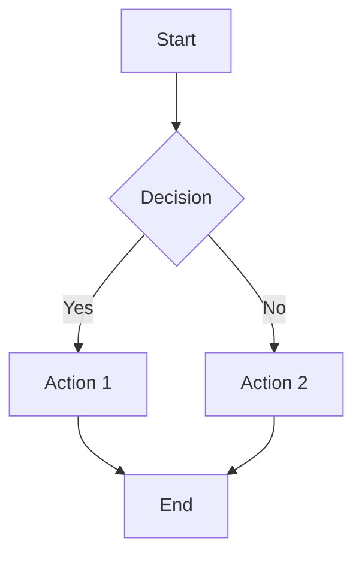
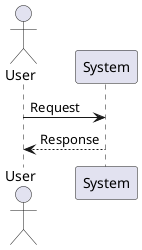

# VibeBox Architecture Documentation

> Comprehensive visual architecture diagrams for the VibeBox platform

This directory contains detailed architecture diagrams in multiple formats, making it easy to understand, communicate, and maintain the system design.

---

## 📁 Available Diagrams

### 1. System Architecture Overview
**Files**: [`system-overview.md`](./system-overview.md) | [`system-overview.puml`](./system-overview.puml) | [`system-overview.txt`](./system-overview.txt)

High-level system architecture showing all major components and their interactions:
- Client layer (Browser, CLI)
- Frontend application (React, Material-UI, xterm.js)
- API layer (Fastify, JWT, WebSocket)
- Service layer (Business logic)
- Data layer (PostgreSQL, Redis)
- External services (Docker, OAuth)
- Infrastructure (Kubernetes)

**Includes**:
- Request/response flows
- WebSocket connection flow
- Component communication patterns
- Deployment architecture
- Security layers
- Performance optimizations

---

### 2. Database Entity Relationship Diagram (ERD)
**Files**: [`database-erd.md`](./database-erd.md) | [`database-erd.dbml`](./database-erd.dbml) | [`database-erd.txt`](./database-erd.txt)

Complete database schema with all 11 tables and relationships:
- **Core Entities**: User, Team, UserTeam, Project, Environment
- **Configuration**: EnvironmentPort, EnvironmentVariable
- **Runtime**: Session, LogEntry
- **Extensions**: Extension, EnvironmentExtension

**Includes**:
- Entity relationships with cardinality
- Primary keys, foreign keys, indexes
- Unique constraints and validation rules
- XOR constraints (Project ownership)
- Cascade delete behavior
- Data retention policies
- Enum type definitions

---

### 3. API Architecture Flow
**Files**: [`api-flow.md`](./api-flow.md)

Detailed API request processing flow:
- Complete middleware chain (CORS → JWT → Rate Limit → Validation → Authorization)
- Error handling flow
- Authentication & authorization flow
- RBAC (Role-Based Access Control)
- Service layer architecture
- Caching strategy
- Database transactions
- Response format standards

**Security Features**:
- 10 security layers
- Input validation
- SQL injection prevention
- Rate limiting
- Audit logging

---

### 4. WebSocket Architecture
**Files**: [`websocket-flow.md`](./websocket-flow.md)

Real-time communication architecture:
- **Log Streaming**: Real-time container logs with historical playback
- **Terminal (PTY)**: Bidirectional terminal with xterm.js
- **Status Updates**: Environment metrics and state changes

**Includes**:
- Connection lifecycle management
- Message types and formats
- Heartbeat & keepalive
- Error handling & recovery
- Scalability with Redis Pub/Sub
- Performance optimizations (batching)
- Connection limits and monitoring

---

### 5. Deployment Architecture
**Files**: [`deployment.md`](./deployment.md)

Kubernetes deployment configuration:
- Cluster overview (Frontend, Backend, Database, Docker namespaces)
- Pod resource allocation
- Network policies
- Service mesh (Istio)
- Rolling update strategy
- Health checks & probes
- Horizontal Pod Autoscaler (HPA)
- Persistent storage architecture
- Backup & disaster recovery
- Monitoring & observability stack
- CI/CD pipeline

**Resource Requirements**:
- Total: 6.8-27.5 CPU, 13.4-53.5Gi Memory, 610Gi Storage
- High availability configuration

---

### 6. Environment Lifecycle
**Files**: [`environment-lifecycle.md`](./environment-lifecycle.md)

State machine for Docker environment management:
- **States**: stopped → starting → running → stopping → error
- Environment creation flow
- Start/stop flows
- Health monitoring
- Resource limit enforcement
- Auto-stop idle environments
- Deletion flow with cascade
- Error recovery strategies

**Metrics**:
- State duration tracking
- Transition counters
- Alert conditions

---

### 7. Authentication & Authorization Flow
**Files**: [`auth-flow.md`](./auth-flow.md)

Complete authentication system:
- **Registration**: Email/password with validation
- **Login**: Email/password and OAuth (GitHub, Google)
- **Token Management**: JWT access tokens (15 min) + refresh tokens (7 days)
- **Authorization**: RBAC with team roles (admin, developer, viewer)
- **Session Management**: Redis-backed with token blacklisting
- **Logout**: Token invalidation and cleanup

**Security Features**:
- Password hashing (bcrypt, 10 rounds)
- Rate limiting (5 login attempts/min)
- CSRF protection
- Token rotation
- Multi-factor authentication (planned)

---

## 🎨 Diagram Formats

Each diagram is available in multiple formats for different use cases:

| Format | Extension | Use Case | View In |
|--------|-----------|----------|---------|
| **Mermaid** | `.md` | GitHub rendering, documentation | GitHub, VS Code, Mermaid Live Editor |
| **PlantUML** | `.puml` | Detailed diagrams, CI/CD integration | PlantUML Online, VS Code, IntelliJ |
| **dbdiagram.io** | `.dbml` | Interactive database schemas | https://dbdiagram.io/ |
| **ASCII Art** | `.txt` | Terminal viewing, no dependencies | Any text editor, terminal |

---

## 🛠️ Viewing & Editing Diagrams

### Viewing Mermaid Diagrams

**On GitHub**:
- Mermaid diagrams render automatically in `.md` files
- Simply open any `.md` file in this directory

**In VS Code**:
```bash
# Install Mermaid extension
code --install-extension bierner.markdown-mermaid

# Open markdown preview
# Cmd+Shift+V (Mac) or Ctrl+Shift+V (Windows/Linux)
```

**Online**:
- Visit [Mermaid Live Editor](https://mermaid.live/)
- Copy diagram code and paste

### Viewing PlantUML Diagrams

**Online**:
- Visit [PlantUML Online Server](https://www.plantuml.com/plantuml/uml/)
- Paste `.puml` file content

**VS Code**:
```bash
# Install PlantUML extension
code --install-extension jebbs.plantuml

# Preview diagram
# Alt+D
```

**CLI** (requires Java + Graphviz):
```bash
# Install PlantUML
brew install plantuml graphviz  # Mac
sudo apt install plantuml graphviz  # Linux

# Generate PNG
plantuml system-overview.puml

# Generate SVG
plantuml -tsvg system-overview.puml
```

### Viewing dbdiagram.io Schemas

1. Visit https://dbdiagram.io/
2. Click "Import" or create new diagram
3. Paste contents of `database-erd.dbml`
4. Interactive schema with zoom, export options

### Viewing ASCII Diagrams

```bash
# View in terminal
cat system-overview.txt
less system-overview.txt

# View in any text editor
code system-overview.txt
vim system-overview.txt
```

---

## 📝 Editing Guidelines

### Mermaid Syntax



**Resources**:
- [Mermaid Documentation](https://mermaid.js.org/)
- [Mermaid Cheat Sheet](https://jojozhuang.github.io/tutorial/mermaid-cheat-sheet/)

### PlantUML Syntax



**Resources**:
- [PlantUML Documentation](https://plantuml.com/)
- [PlantUML Cheat Sheet](https://ogom.github.io/draw_uml/plantuml/)

### dbdiagram.io Syntax

```dbml
Table users {
  id uuid [pk]
  email varchar [unique, not null]
  created_at timestamp
}

Ref: projects.user_id > users.id
```

**Resources**:
- [DBML Documentation](https://dbml.dbdiagram.io/docs/)

---

## 🎨 Diagram Style Guide

### Color Conventions

We use consistent colors across all diagrams:

| Color | Hex | Usage |
|-------|-----|-------|
| 🔵 Blue | `#3498db` | Controllers, API layer |
| 🟢 Green | `#27ae60` | Services, success states |
| 🟠 Orange | `#f39c12` | Service layer, warnings |
| 🔴 Red | `#e74c3c` | Errors, external services |
| 🟣 Purple | `#9b59b6` | Infrastructure, secrets |
| ⚪ Gray | `#95a5a6` | External, disabled |
| 🟦 Light Blue | `#61dafb` | Frontend, React |
| 🟩 Dark Green | `#68a063` | Backend, Fastify |
| 🟪 Dark Purple | `#336791` | Database, PostgreSQL |

### Naming Conventions

- **Nodes**: PascalCase for components (`UserService`, `PostgreSQL`)
- **Labels**: Title Case for actions (`Create User`, `Send Request`)
- **Files**: kebab-case (`system-overview.md`, `api-flow.md`)

### Diagram Best Practices

1. **Keep it Simple**: One diagram, one concept
2. **Add Legends**: Explain colors, symbols, abbreviations
3. **Use Hierarchy**: Group related components in subgraphs
4. **Label Everything**: All arrows, nodes, and transitions
5. **Include Notes**: Add context with note blocks
6. **Show Cardinality**: For relationships (1:1, 1:N, N:M)
7. **Highlight Paths**: Use different line styles for different flows

---

## 🔄 Keeping Diagrams Updated

### When to Update

Update diagrams when:
- ✅ New features are added
- ✅ Architecture changes
- ✅ Data model changes (new tables, relationships)
- ✅ API endpoints added/modified
- ✅ Infrastructure changes
- ✅ Security model updates

### Update Process

1. **Modify Diagram**: Edit source file (`.md`, `.puml`, `.dbml`)
2. **Regenerate Images**: If using PlantUML, regenerate PNGs/SVGs
3. **Test Rendering**: Preview in GitHub/VS Code
4. **Update Index**: Update this README if new diagrams added
5. **Commit Changes**: Clear commit message explaining the change

### Automated Diagram Generation

For PlantUML diagrams in CI/CD:

```yaml
# .github/workflows/diagrams.yml
name: Generate Diagrams
on: [push]
jobs:
  diagrams:
    runs-on: ubuntu-latest
    steps:
      - uses: actions/checkout@v3
      - name: Generate PlantUML Diagrams
        uses: cloudbees/plantuml-github-action@master
        with:
          args: -v -tsvg docs/architecture/*.puml
      - name: Commit Generated Files
        run: |
          git add docs/architecture/*.svg
          git commit -m "Update generated diagrams"
          git push
```

---

## 📚 Related Documentation

- **[Spec Kit Contracts](../../.claude/specs.md)** - Data models and architecture overview
- **[API Reference](../../.claude/api_reference.md)** - Complete API documentation
- **[Quick Start Guide](../../.claude/quick_start.md)** - Setup and onboarding
- **[Development Workflow](../../.claude/dev_workflow.md)** - PR process and CI/CD
- **[Security Guide](../../.claude/security.md)** - Security best practices

---

## 🤝 Contributing

### Adding New Diagrams

1. Create diagram in appropriate format (Mermaid recommended)
2. Follow naming convention: `feature-name.md`
3. Add multiple formats if possible (`.md`, `.puml`, `.txt`)
4. Update this README with:
   - Diagram description
   - File links
   - What it includes
5. Test rendering on GitHub
6. Submit PR with clear description

### Diagram Improvement Requests

Found an issue or have a suggestion?
- 🐛 **Bug**: Diagram is incorrect or outdated
- 💡 **Enhancement**: Additional detail would be helpful
- 📝 **Clarification**: Unclear labeling or flow

Open an issue with label `documentation` and `diagram`.

---

## 📋 Diagram Checklist

When creating a new diagram, ensure:

- [ ] Follows style guide (colors, naming)
- [ ] Has clear title and description
- [ ] All nodes and edges are labeled
- [ ] Includes legend if needed
- [ ] Notes explain complex parts
- [ ] Multiple formats provided (if applicable)
- [ ] Renders correctly on GitHub
- [ ] Linked in this README
- [ ] Source code is readable and formatted
- [ ] Scales well (readable at different zoom levels)

---

## 🔗 External Resources

### Mermaid
- [Official Documentation](https://mermaid.js.org/)
- [Live Editor](https://mermaid.live/)
- [GitHub Mermaid Support](https://github.blog/2022-02-14-include-diagrams-markdown-files-mermaid/)

### PlantUML
- [Official Documentation](https://plantuml.com/)
- [Online Server](https://www.plantuml.com/plantuml/uml/)
- [VS Code Extension](https://marketplace.visualstudio.com/items?itemName=jebbs.plantuml)

### dbdiagram.io
- [Official Website](https://dbdiagram.io/)
- [DBML Documentation](https://dbml.dbdiagram.io/docs/)
- [CLI Tool](https://github.com/holistics/dbml)

### Architecture Tools
- [C4 Model](https://c4model.com/) - Software architecture diagrams
- [ArchiMate](https://www.opengroup.org/archimate-forum) - Enterprise architecture
- [draw.io](https://app.diagrams.net/) - General diagramming tool

---

## 📊 Diagram Statistics

| Category | Count | Formats |
|----------|-------|---------|
| System Architecture | 1 | Mermaid, PlantUML, ASCII |
| Database Schemas | 1 | Mermaid, DBML, ASCII |
| API Flows | 1 | Mermaid |
| WebSocket Flows | 1 | Mermaid |
| Deployment | 1 | Mermaid |
| State Machines | 1 | Mermaid |
| Auth Flows | 1 | Mermaid |
| **Total** | **7** | **3 formats** |

---

## 💡 Tips

- **GitHub Dark Mode**: Most diagrams are optimized for both light and dark themes
- **Print-Friendly**: ASCII diagrams work well for printed documentation
- **Presentations**: Use PlantUML SVG exports for slides
- **Interactive**: dbdiagram.io allows interactive exploration
- **Version Control**: All formats are text-based and git-friendly

---

**Last Updated**: 2025-10-01
**Maintainer**: VibeBox Team
**License**: MIT (see [LICENSE](../../.claude/license.md))
