# API Architecture Flow

## Complete API Request Flow

This diagram shows the complete flow of an API request through VibeBox's backend architecture.

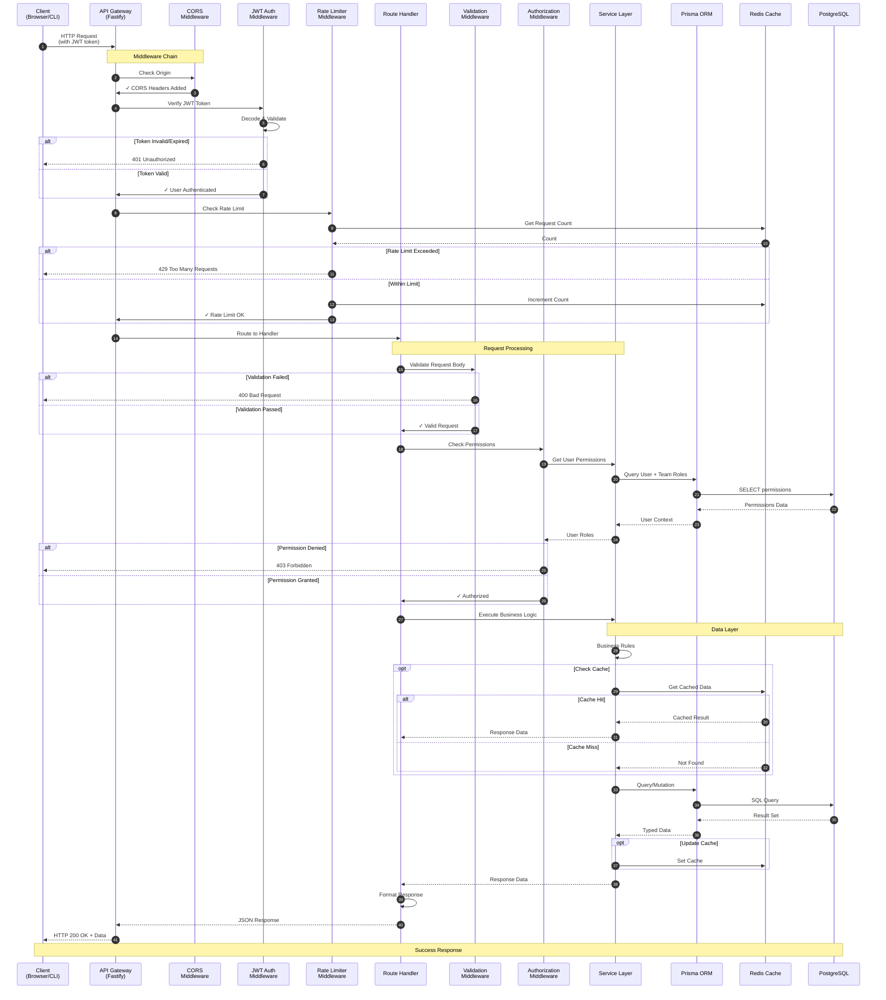

## Error Handling Flow

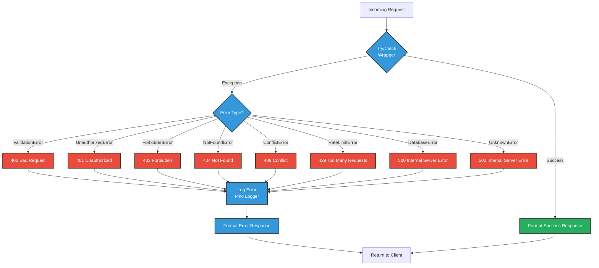

## Authentication & Authorization Flow

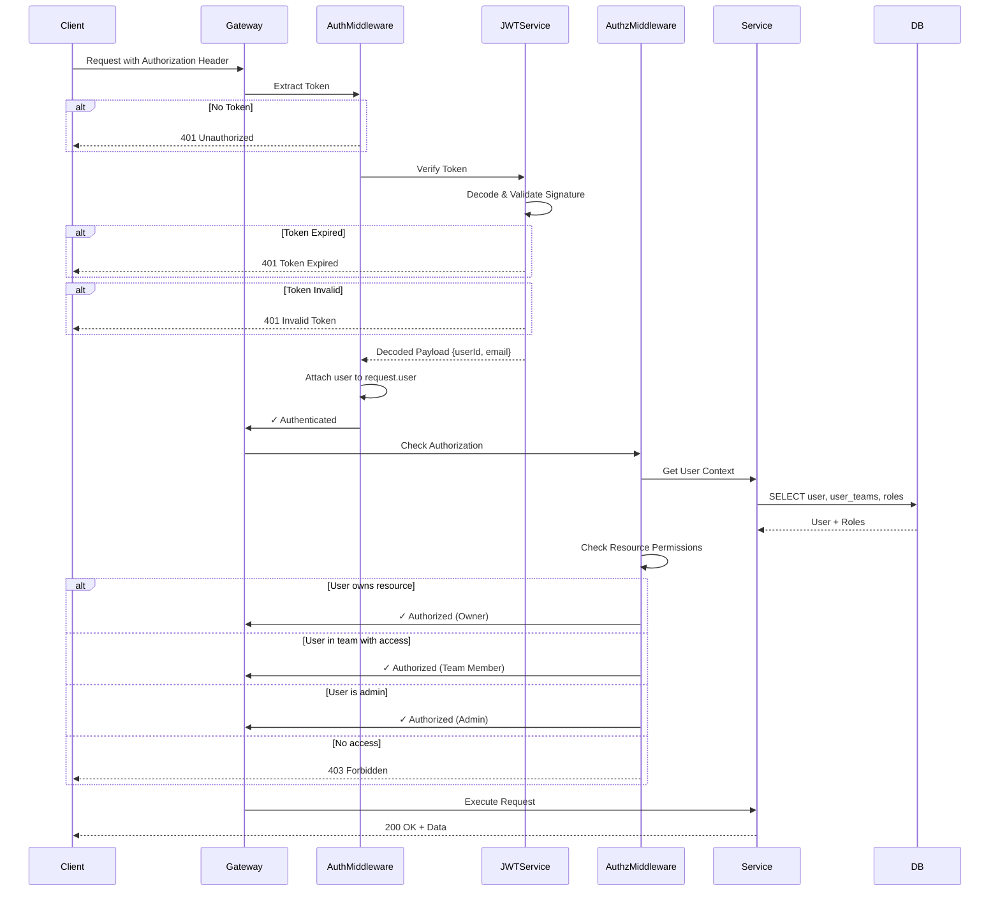

## RBAC (Role-Based Access Control)

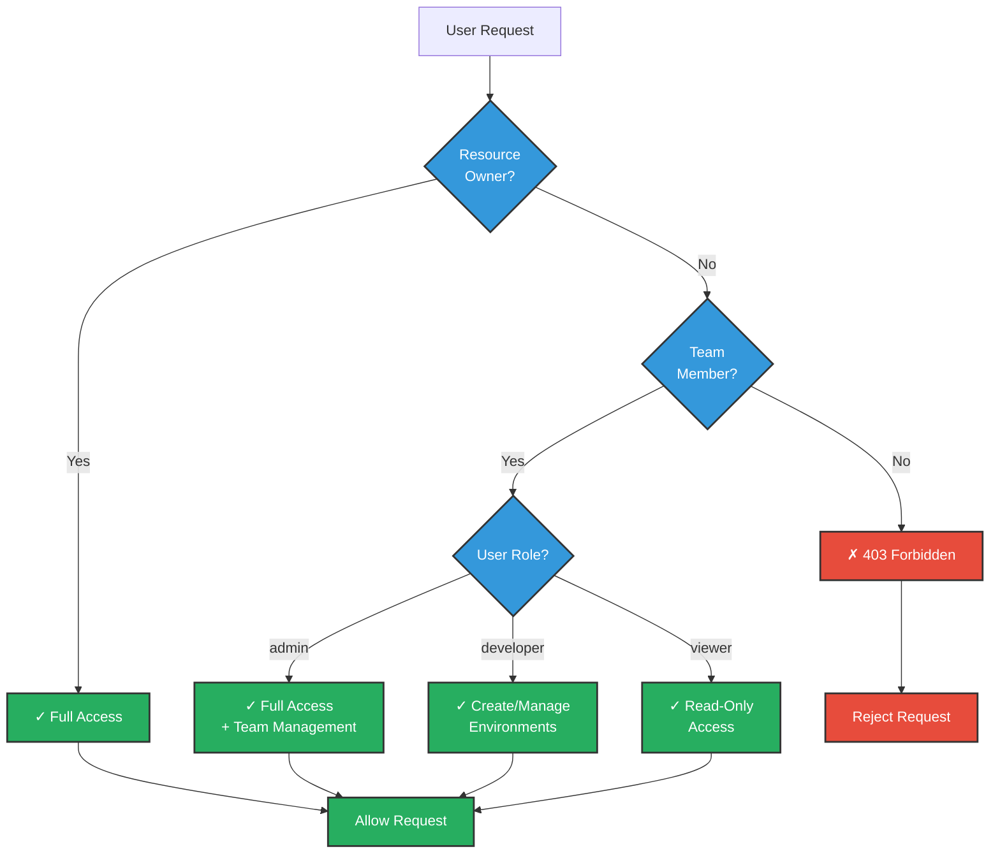

## Service Layer Architecture

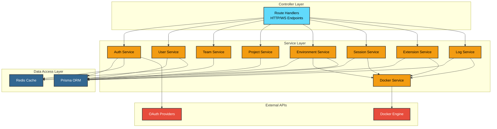

## Middleware Chain

```mermaid
graph LR
    Request[Incoming<br/>Request]

    Request --> M1[1. CORS<br/>Cross-Origin]
    M1 --> M2[2. Logging<br/>Request Logger]
    M2 --> M3[3. JWT Auth<br/>Verify Token]
    M3 --> M4[4. Rate Limit<br/>Throttle]
    M4 --> M5[5. Body Parser<br/>JSON/Form]
    M5 --> M6[6. Validation<br/>Schema Check]
    M6 --> M7[7. Authorization<br/>Permission Check]
    M7 --> Handler[Route<br/>Handler]

    Handler --> Response[Response]

    classDef middleware fill:#3498db,stroke:#333,stroke-width:2px,color:#fff
    classDef endpoint fill:#27ae60,stroke:#333,stroke-width:2px,color:#fff

    class M1,M2,M3,M4,M5,M6,M7 middleware
    class Request,Handler,Response endpoint
```

## Caching Strategy

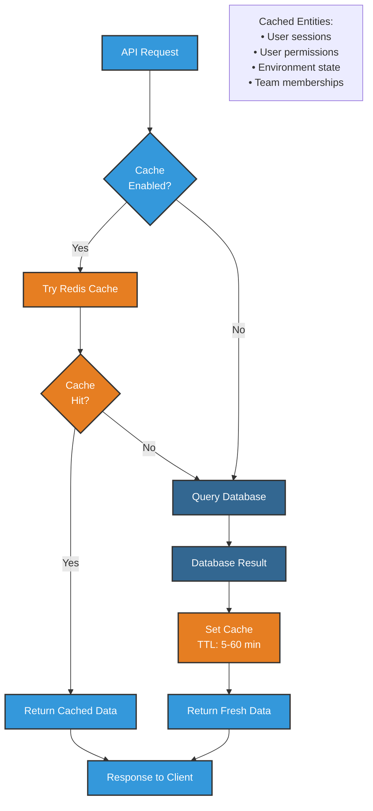

## Database Transaction Flow

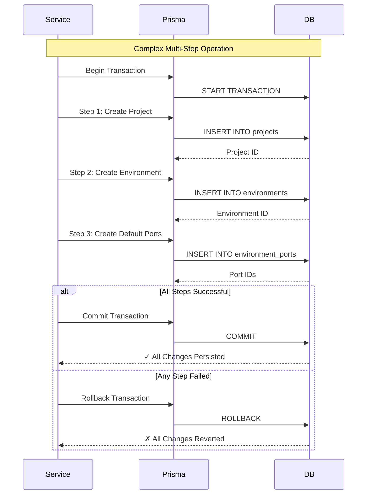

## API Response Format

### Success Response
```json
{
  "success": true,
  "data": {
    "id": "uuid",
    "name": "example",
    ...
  },
  "meta": {
    "timestamp": "2025-10-01T12:00:00Z",
    "requestId": "req-123"
  }
}
```

### Error Response
```json
{
  "success": false,
  "error": {
    "code": "VALIDATION_ERROR",
    "message": "Invalid input data",
    "details": [
      {
        "field": "name",
        "issue": "Name is required"
      }
    ]
  },
  "meta": {
    "timestamp": "2025-10-01T12:00:00Z",
    "requestId": "req-123"
  }
}
```

## Performance Optimizations

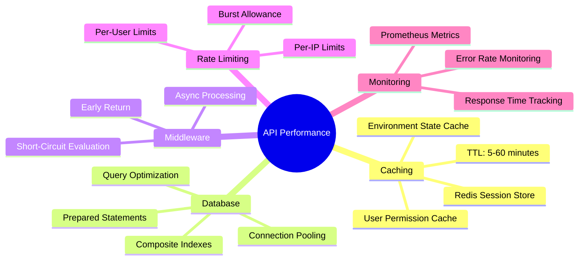

## Common API Patterns

### Pagination
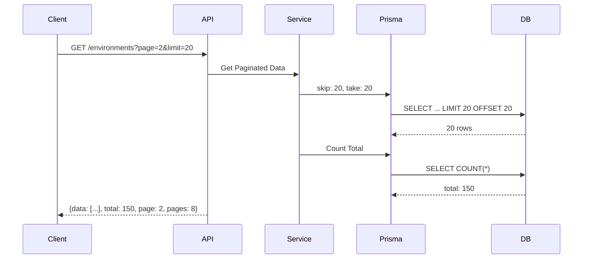

### Filtering & Sorting
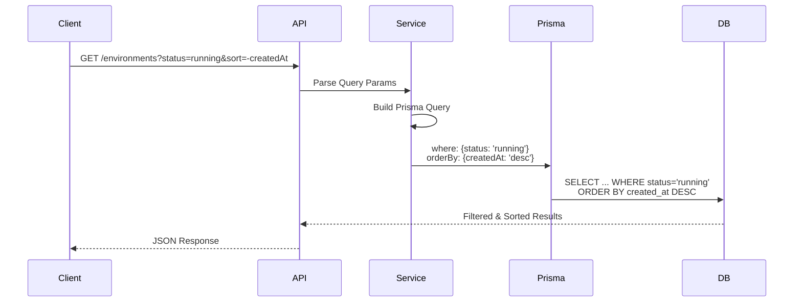

## Security Layers in API

1. **Network Layer**: TLS 1.3, HTTPS only
2. **Gateway Layer**: CORS, Rate Limiting
3. **Authentication**: JWT token verification
4. **Authorization**: RBAC + Resource ownership
5. **Input Validation**: Schema validation (Zod)
6. **SQL Injection**: Prisma ORM (parameterized queries)
7. **XSS Protection**: Output sanitization
8. **CSRF Protection**: SameSite cookies
9. **Audit Logging**: All mutations logged
10. **Error Handling**: No sensitive data in errors
