# Authentication & Authorization Flow

## User Registration Flow

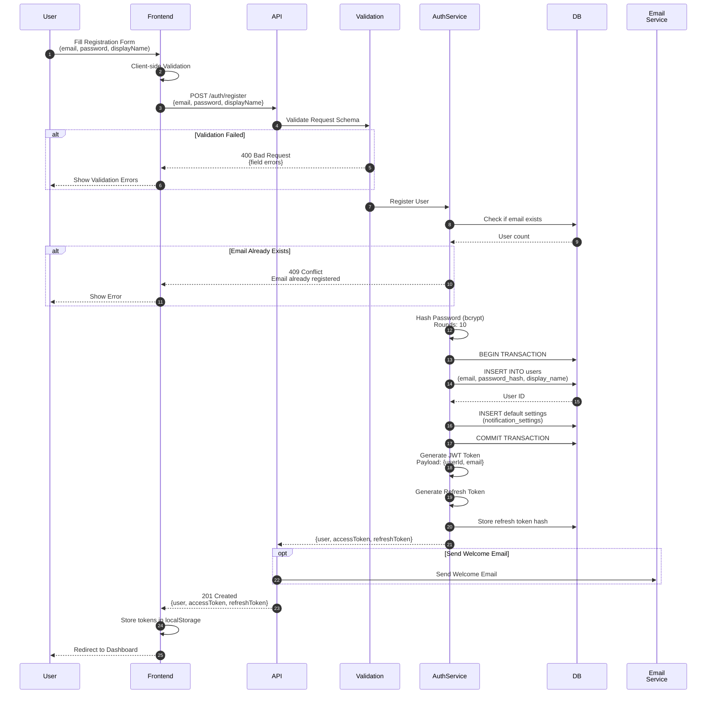

## Login Flow (Email/Password)

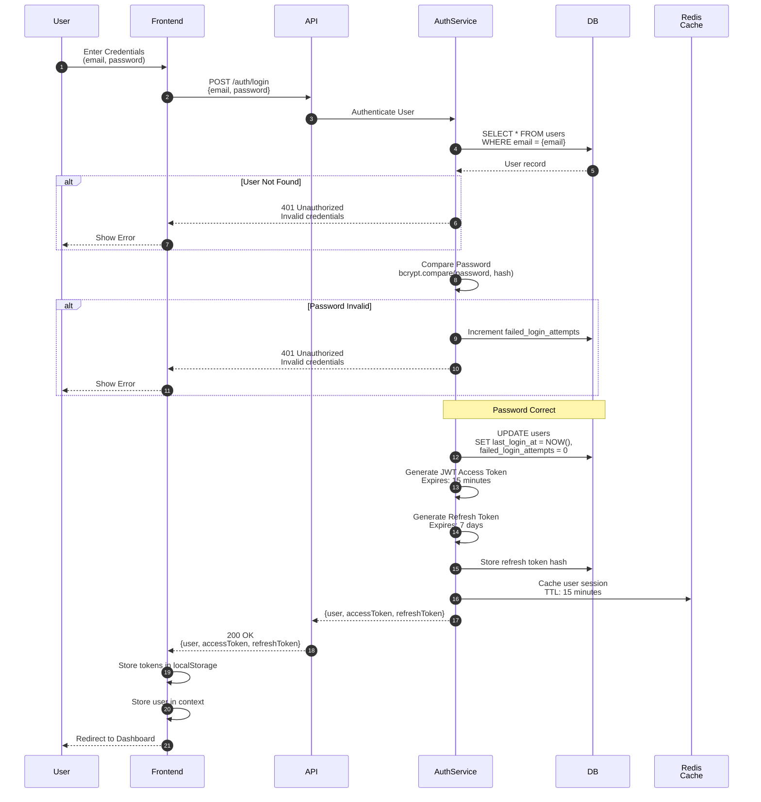

## OAuth Login Flow (GitHub/Google)

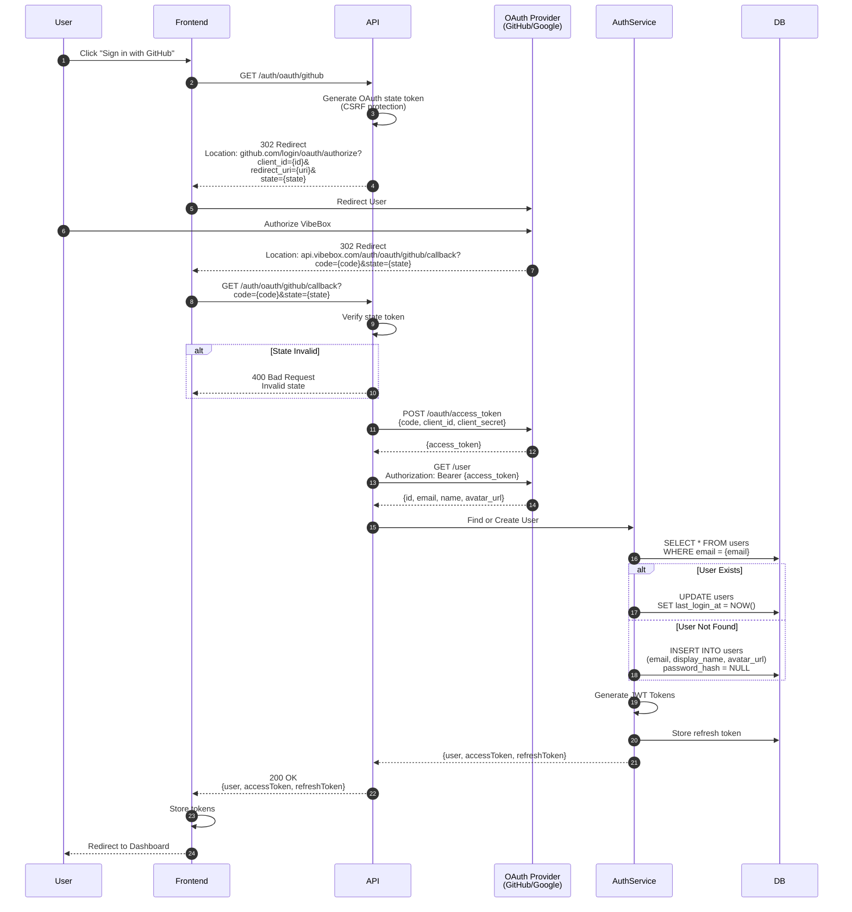

## Token Refresh Flow

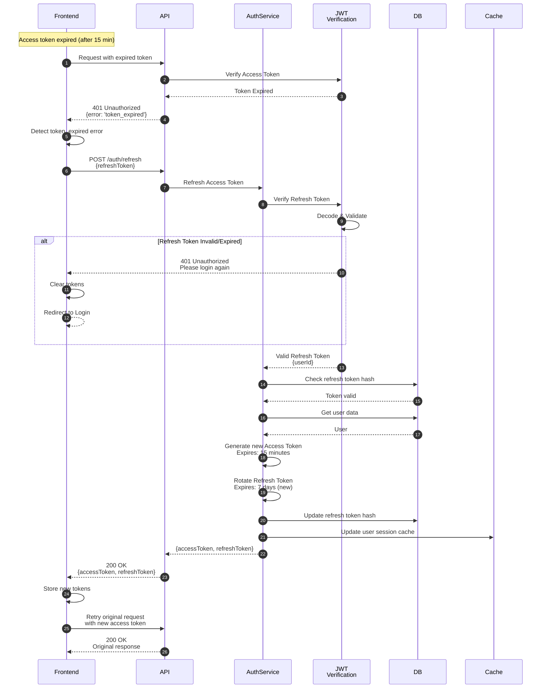

## JWT Token Structure

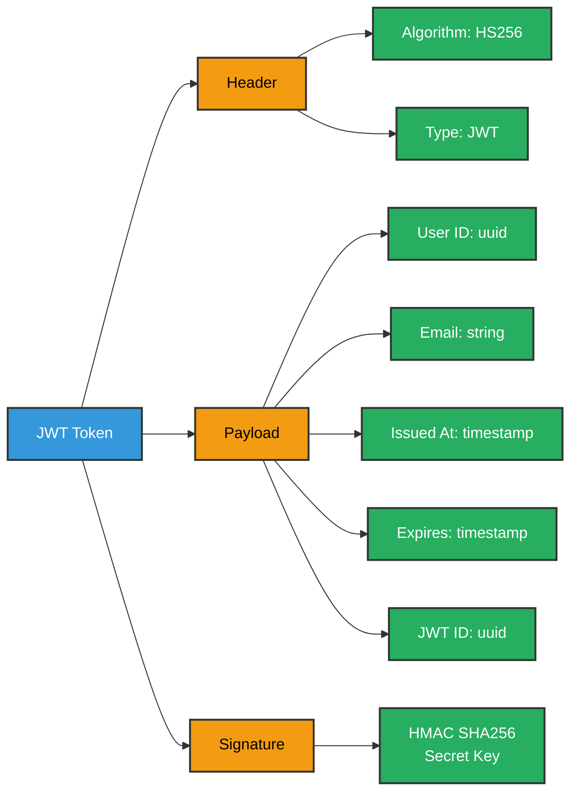

**Access Token Example**:
```json
{
  "header": {
    "alg": "HS256",
    "typ": "JWT"
  },
  "payload": {
    "userId": "123e4567-e89b-12d3-a456-426614174000",
    "email": "user@example.com",
    "iat": 1696176000,
    "exp": 1696176900,
    "jti": "access-abc123"
  }
}
```

## Authorization Middleware Flow

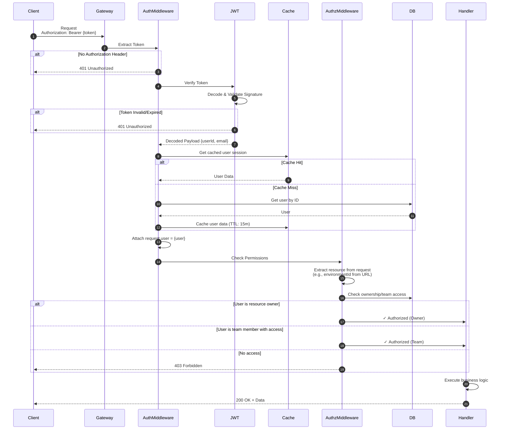

## Permission Checking Logic

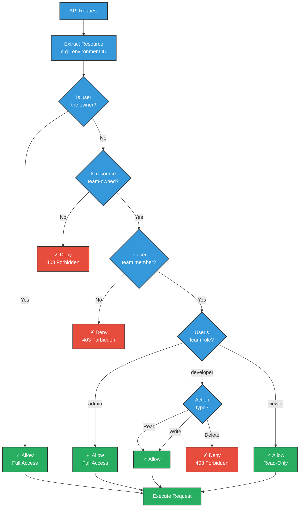

## RBAC Permission Matrix

```mermaid
graph TB
    subgraph "Team Admin"
        AdminPerms[Permissions:<br/>• Manage team<br/>• Add/remove members<br/>• Create projects<br/>• Manage all environments<br/>• Delete team resources]
    end

    subgraph "Team Developer"
        DevPerms[Permissions:<br/>• View team resources<br/>• Create projects<br/>• Manage own projects<br/>• Create environments<br/>• Manage own environments<br/>• Cannot delete team resources]
    end

    subgraph "Team Viewer"
        ViewerPerms[Permissions:<br/>• View team resources<br/>• View projects<br/>• View environments<br/>• View logs (read-only)<br/>• Cannot modify anything]
    end

    subgraph "Resource Owner"
        OwnerPerms[Permissions:<br/>• Full control<br/>• All CRUD operations<br/>• Transfer ownership<br/>• Delete resource]
    end

    User[User]

    User -->|role: admin| AdminPerms
    User -->|role: developer| DevPerms
    User -->|role: viewer| ViewerPerms
    User -->|owns resource| OwnerPerms

    classDef role fill:#3498db,stroke:#333,stroke-width:2px,color:#fff
    classDef perms fill:#27ae60,stroke:#333,stroke-width:2px,color:#fff
    classDef user fill:#f39c12,stroke:#333,stroke-width:2px,color:#000

    class AdminPerms,DevPerms,ViewerPerms,OwnerPerms perms
    class User user
```

## Session Management

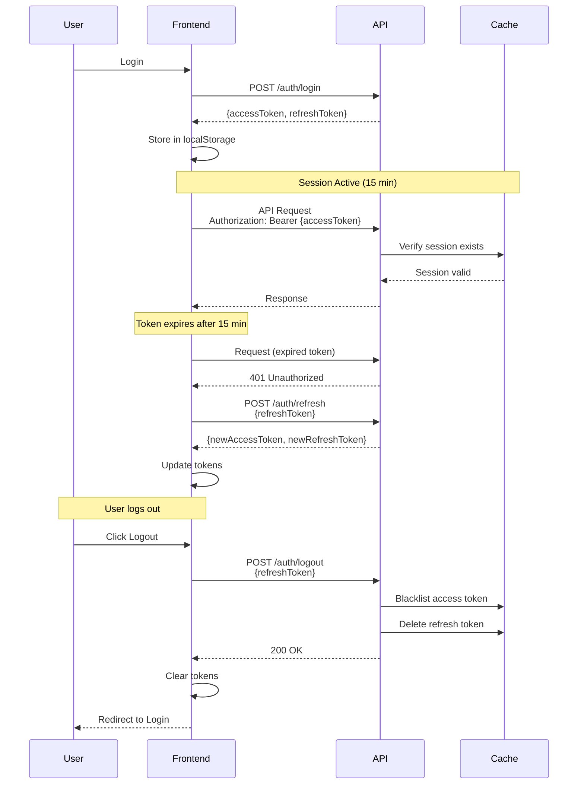

## Security Features

### Password Security
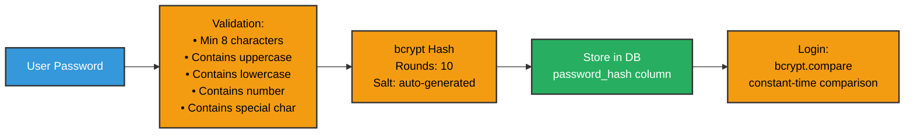

### Rate Limiting
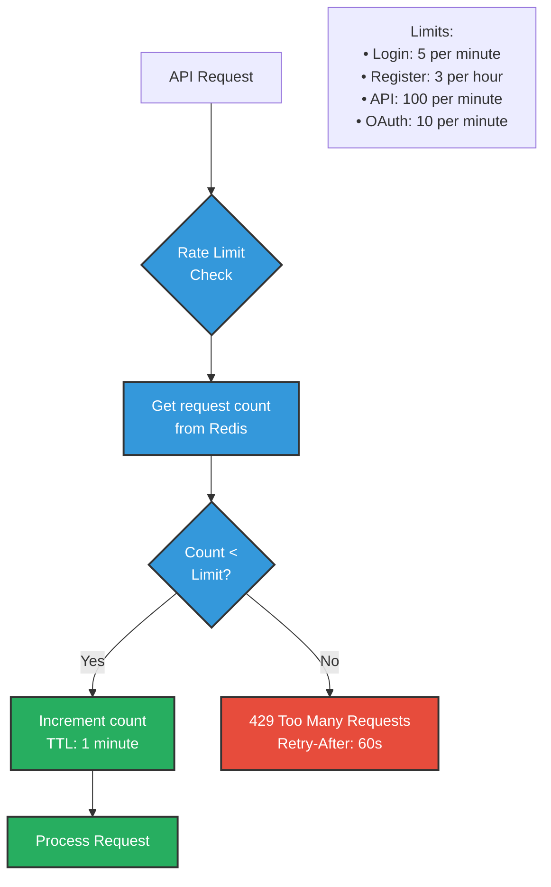

### CSRF Protection
- **SameSite Cookies**: Set to `Strict` or `Lax`
- **State Parameter**: OAuth flows use random state token
- **Origin Checking**: Verify Origin/Referer headers
- **Token Rotation**: Refresh tokens rotated on use

### Token Security
- **Short-lived Access Tokens**: 15 minutes expiry
- **Refresh Token Rotation**: New refresh token on each use
- **Token Blacklisting**: Logout adds token to Redis blacklist
- **Secure Storage**: Tokens in httpOnly cookies (recommended) or localStorage

## Logout Flow

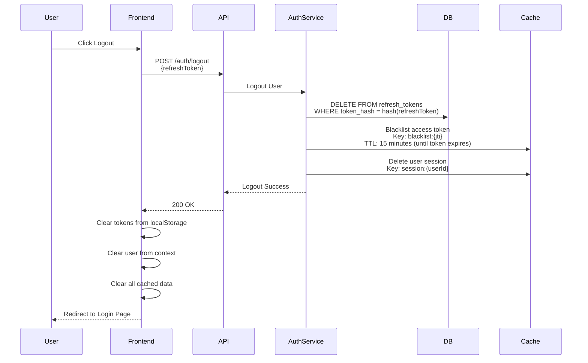

## Multi-Factor Authentication (Future)

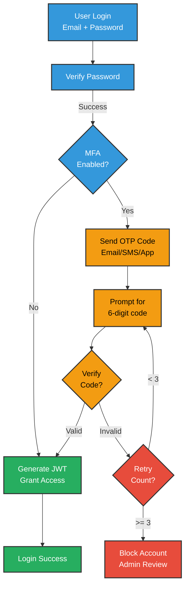

## Token Expiry & Rotation Summary

| Token Type | Expiry | Rotation | Storage | Purpose |
|-----------|--------|----------|---------|---------|
| Access Token | 15 minutes | No | localStorage/cookie | API authentication |
| Refresh Token | 7 days | Yes (on use) | httpOnly cookie/localStorage | Token refresh |
| OAuth State | 5 minutes | N/A | Session | CSRF protection |
| Password Reset | 1 hour | N/A | DB + Email | Password reset |
| Email Verification | 24 hours | N/A | DB + Email | Email verification |
