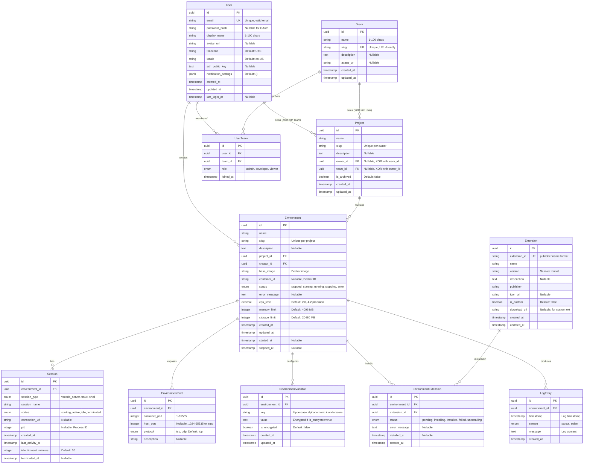
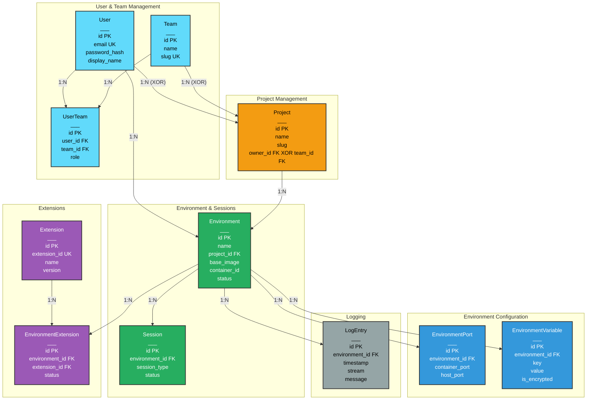
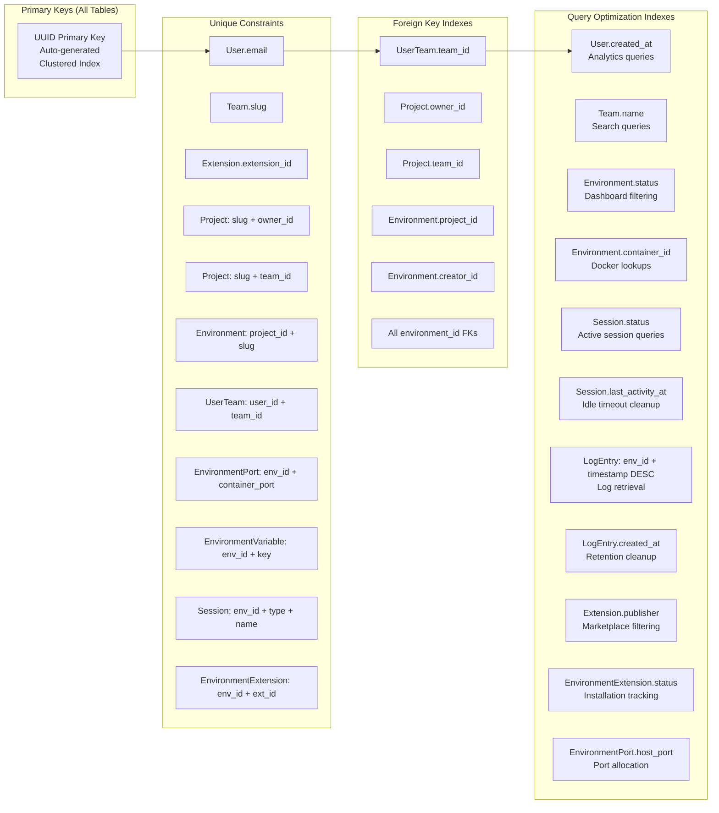
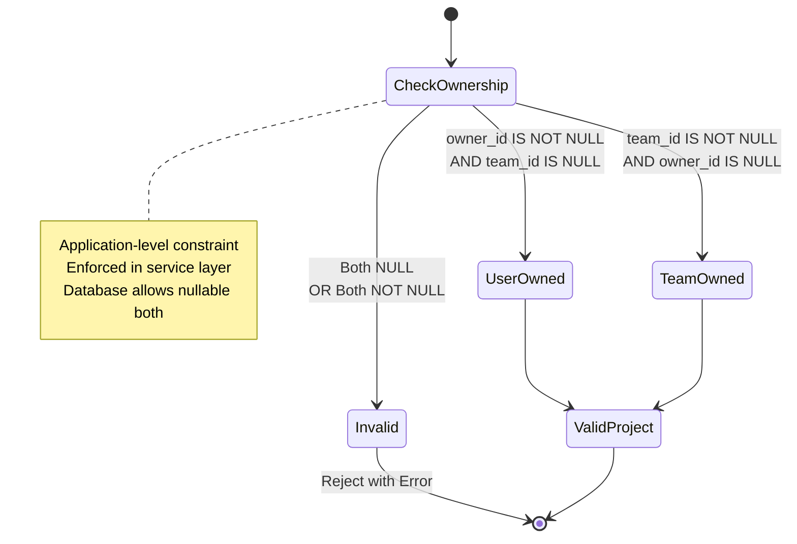
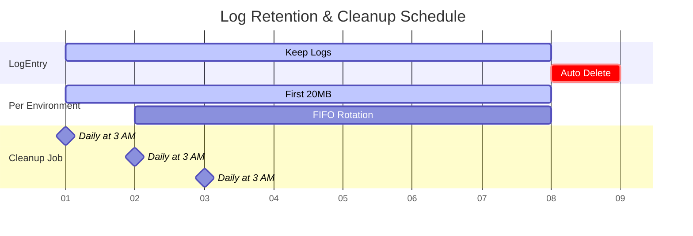

# Database Entity Relationship Diagram

## Complete ERD - Mermaid Format

This diagram shows all 10 entities in the VibeBox database with their relationships, keys, and cardinality.

## Entity Relationships with Cardinality

## Database Indexes

## XOR Constraint - Project Ownership

Projects must be owned by EXACTLY ONE of:
- A User (personal project)
- A Team (team project)

## Cascade Delete Behavior

```mermaid
graph TD
    User[User Deleted]
    Team[Team Deleted]
    Project[Project Deleted]
    Environment[Environment Deleted]

    User -->|CASCADE| UserTeam1[UserTeam<br/>membership removed]
    User -->|CASCADE| Project1[Personal Projects<br/>deleted]

    Team -->|CASCADE| UserTeam2[All UserTeam<br/>memberships removed]
    Team -->|CASCADE| Project2[Team Projects<br/>deleted]

    Project -->|CASCADE| Environment1[All Environments<br/>deleted]

    Environment -->|CASCADE| Session[Sessions terminated]
    Environment -->|CASCADE| EnvPort[Ports released]
    Environment -->|CASCADE| EnvVar[Variables removed]
    Environment -->|CASCADE| EnvExt[Extensions uninstalled]
    Environment -->|CASCADE| LogEntry[Logs deleted]

    Extension[Extension Deleted] -->|CASCADE| EnvExt2[EnvironmentExtension<br/>removed from all envs]

    classDef deleteAction fill:#e74c3c,stroke:#333,stroke-width:2px,color:#fff
    classDef cascadeAction fill:#f39c12,stroke:#333,stroke-width:2px,color:#000

    class User,Team,Project,Environment,Extension deleteAction
    class UserTeam1,UserTeam2,Project1,Project2,Environment1,Session,EnvPort,EnvVar,EnvExt,EnvExt2,LogEntry cascadeAction
```

## Data Retention Policies

**Retention Rules**:
- LogEntry: 7 days OR 20MB per environment (whichever reached first)
- Deleted environments: All related data cascades immediately
- Archived projects: Data retained but environments stopped
- Soft delete: Not implemented (hard deletes with cascade)

## Enum Types

### UserTeamRole
- `admin`: Full team management permissions
- `developer`: Create/manage projects and environments
- `viewer`: Read-only access

### EnvironmentStatus
- `stopped`: Not running, can be started
- `starting`: Container creation in progress
- `running`: Container active and healthy
- `stopping`: Shutdown in progress
- `error`: Failed state, requires intervention

### SessionType
- `vscode_server`: VS Code Server instance
- `tmux`: tmux session for terminal multiplexing
- `shell`: Simple shell session

### SessionStatus
- `starting`: Initializing
- `active`: Currently used
- `idle`: No activity for idle_timeout_minutes
- `terminated`: Stopped

### EnvironmentExtensionStatus
- `pending`: Queued for installation
- `installing`: Installation in progress
- `installed`: Successfully installed
- `failed`: Installation failed
- `uninstalling`: Removal in progress

### Protocol
- `tcp`: TCP protocol (default)
- `udp`: UDP protocol

### LogStream
- `stdout`: Standard output
- `stderr`: Standard error

## Constraints Summary

| Table | Unique Constraints | Foreign Keys | Check Constraints |
|-------|-------------------|--------------|-------------------|
| User | email | - | email format, display_name length |
| Team | slug | - | slug format (lowercase, 3-50 chars) |
| UserTeam | user_id + team_id | user_id, team_id | - |
| Project | slug + owner_id, slug + team_id | owner_id, team_id | XOR (owner_id, team_id) |
| Environment | project_id + slug | project_id, creator_id | cpu_limit > 0, memory > 0 |
| EnvironmentPort | env_id + container_port | environment_id | port ranges |
| EnvironmentVariable | env_id + key | environment_id | key format (uppercase) |
| Session | env_id + type + name | environment_id | idle_timeout > 0 |
| Extension | extension_id | - | semver format, extension_id format |
| EnvironmentExtension | env_id + extension_id | environment_id, extension_id | - |
| LogEntry | - | environment_id | timestamp valid |
