# Deployment Architecture

## Kubernetes Cluster Overview

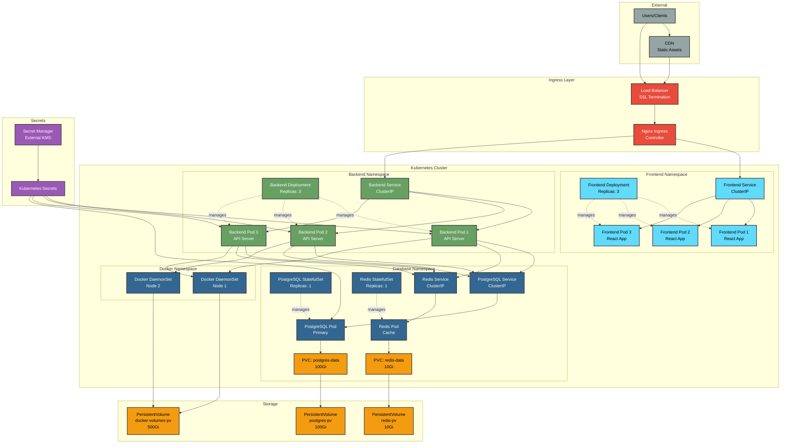

## Pod Resource Allocation

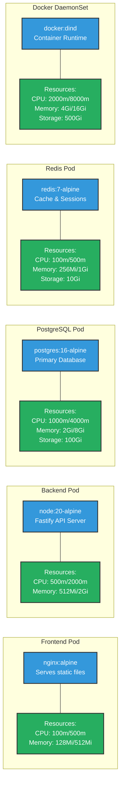

## Network Policies

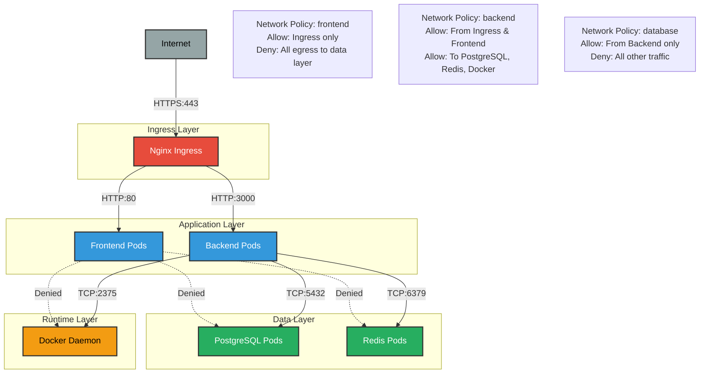

## Service Mesh (Optional)

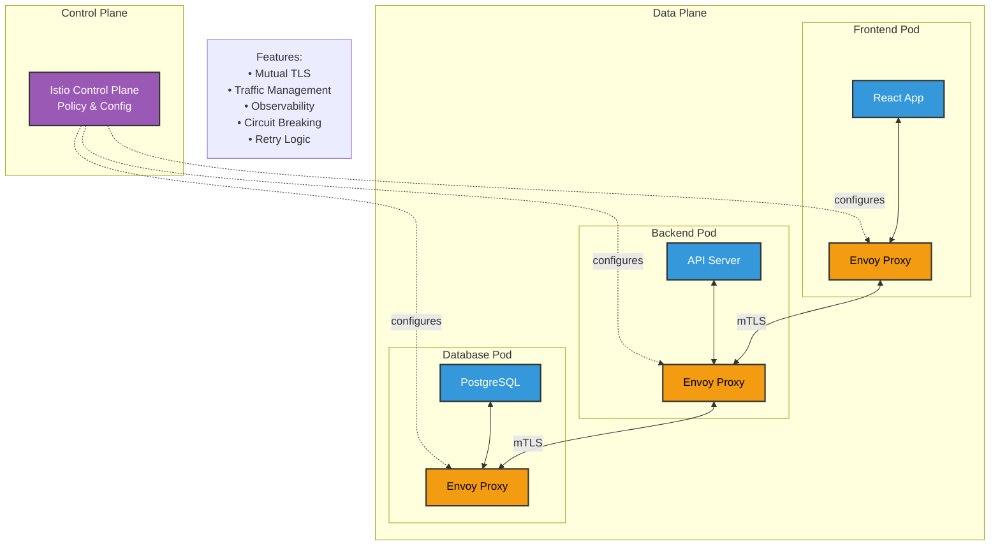

## Deployment Strategy: Rolling Update

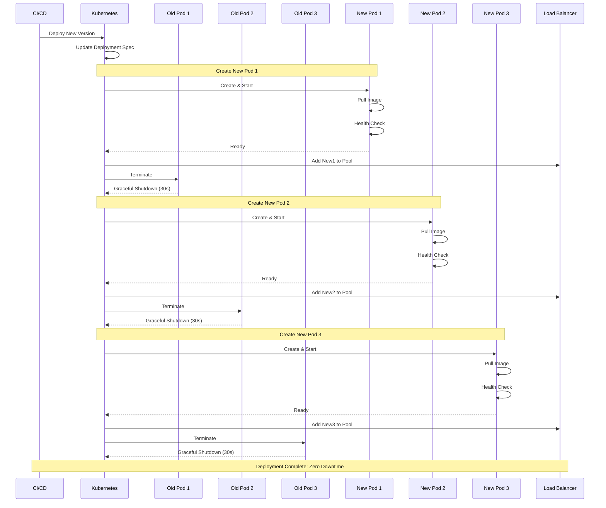

## Health Checks & Probes

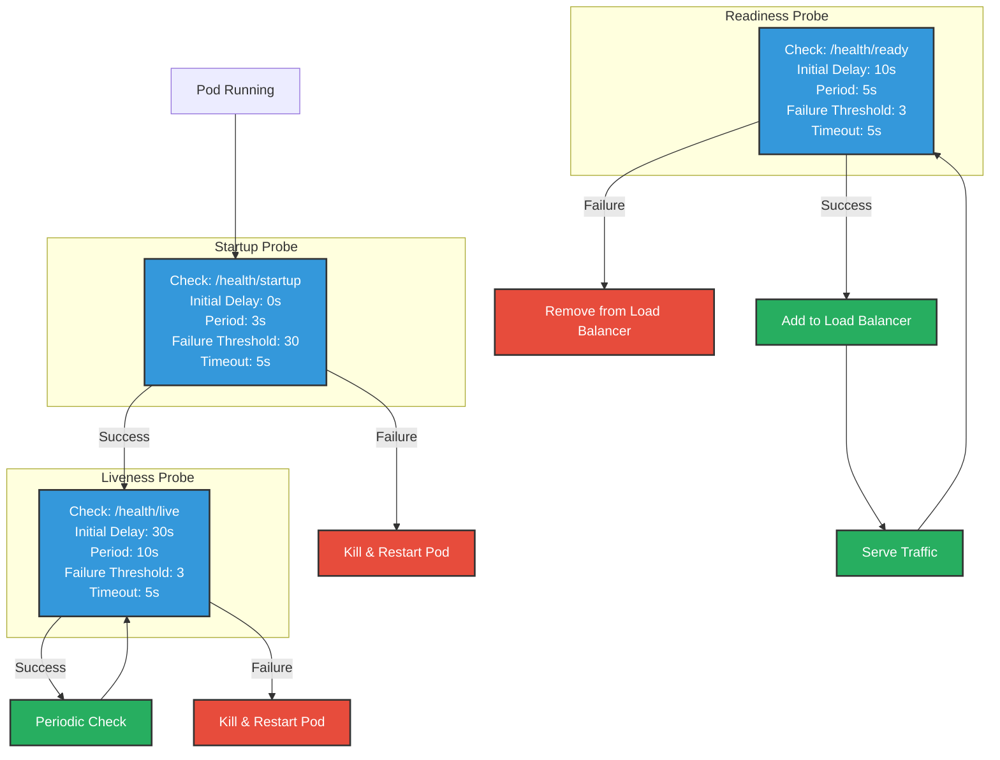

## Autoscaling Configuration

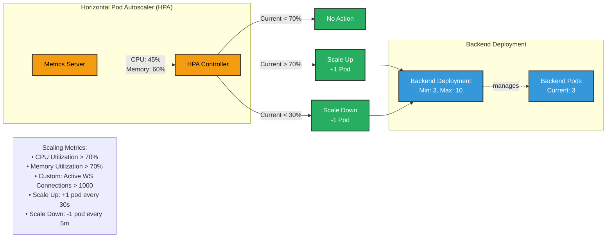

## Persistent Storage Architecture

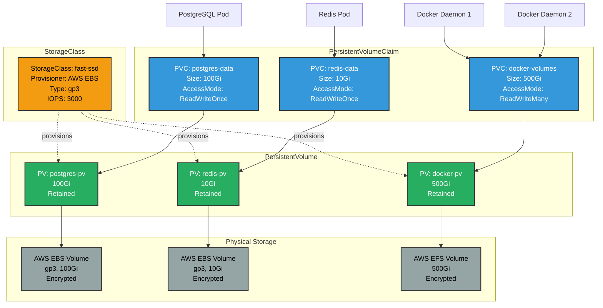

## Backup & Disaster Recovery

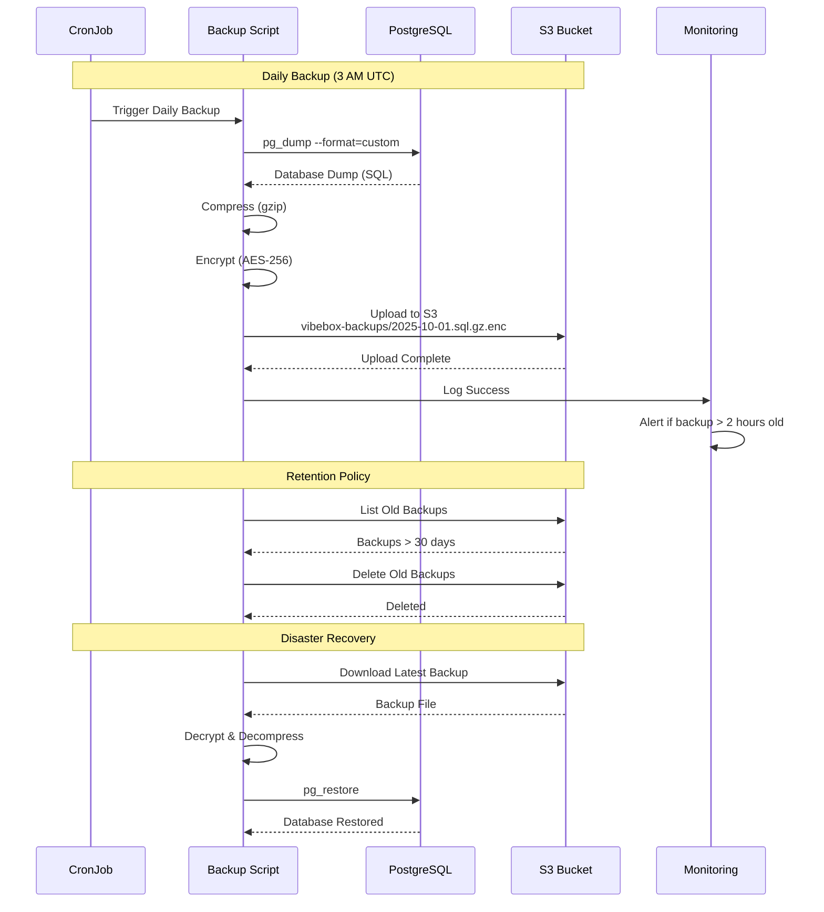

## Monitoring & Observability Stack

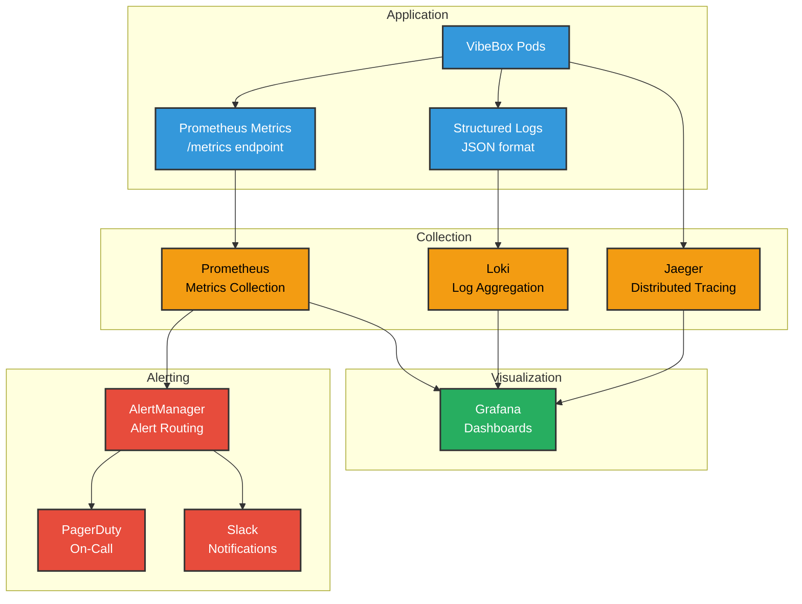

## CI/CD Pipeline

```mermaid
graph LR
    Dev[Developer]
    Git[GitHub Repo]
    CI[GitHub Actions]
    Build[Build & Test]
    Registry[Container Registry<br/>ECR/DockerHub]
    Deploy[ArgoCD]
    K8s[Kubernetes Cluster]
    Notify[Slack Notification]

    Dev -->|Push Code| Git
    Git -->|Webhook| CI
    CI --> Build
    Build -->|Tests Pass| Registry
    Build -->|Tests Fail| Notify

    Registry -->|New Image| Deploy
    Deploy -->|GitOps Sync| K8s
    K8s -->|Deployment Success| Notify

    classDef dev fill:#61dafb,stroke:#333,stroke-width:2px,color:#000
    classDef ci fill:#f39c12,stroke:#333,stroke-width:2px,color:#000
    classDef deploy fill:#27ae60,stroke:#333,stroke-width:2px,color:#fff
    classDef notify fill:#e74c3c,stroke:#333,stroke-width:2px,color:#fff

    class Dev,Git dev
    class CI,Build ci
    class Registry,Deploy,K8s deploy
    class Notify notify
```

## Resource Requirements Summary

| Component | Min CPU | Max CPU | Min Memory | Max Memory | Storage |
|-----------|---------|---------|------------|------------|---------|
| Frontend Pod | 100m | 500m | 128Mi | 512Mi | - |
| Backend Pod | 500m | 2000m | 512Mi | 2Gi | - |
| PostgreSQL | 1000m | 4000m | 2Gi | 8Gi | 100Gi |
| Redis | 100m | 500m | 256Mi | 1Gi | 10Gi |
| Docker Daemon | 2000m | 8000m | 4Gi | 16Gi | 500Gi |
| **Total (3 replicas)** | **6.8 CPU** | **27.5 CPU** | **13.4Gi** | **53.5Gi** | **610Gi** |

## High Availability Configuration

- **Frontend**: 3 replicas, rolling updates
- **Backend**: 3 replicas, rolling updates
- **PostgreSQL**: 1 primary (HA with replication recommended)
- **Redis**: 1 instance (Redis Sentinel for HA recommended)
- **Ingress**: Multi-AZ load balancer
- **Storage**: Cross-AZ replication enabled
- **Backups**: Daily to S3, 30-day retention
