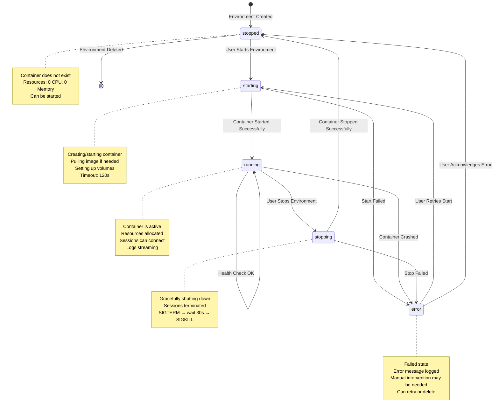
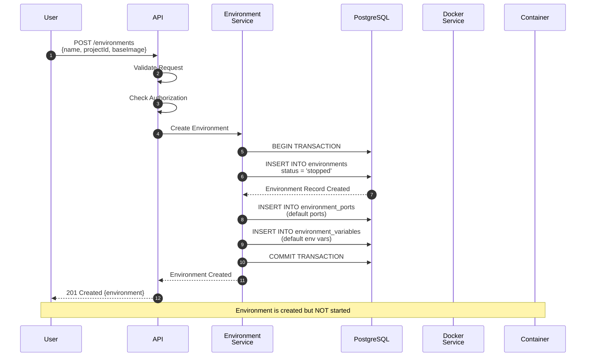
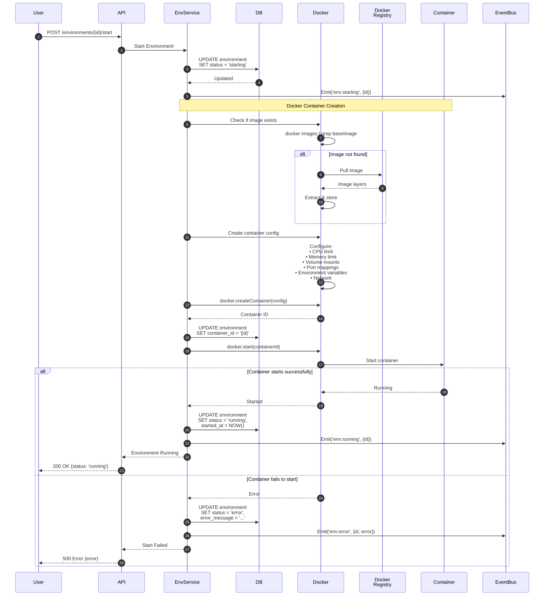
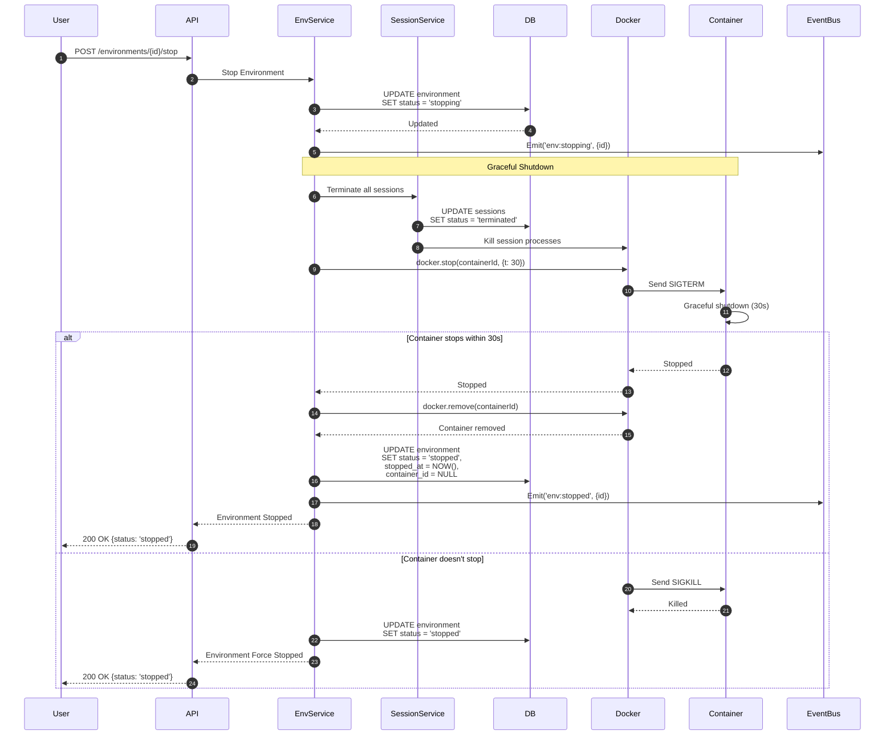
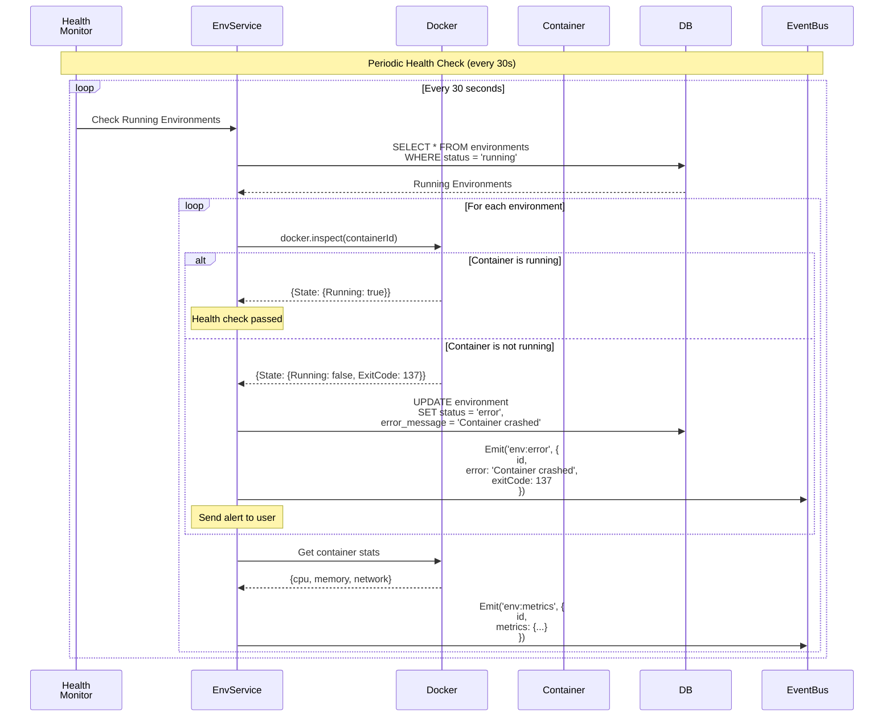
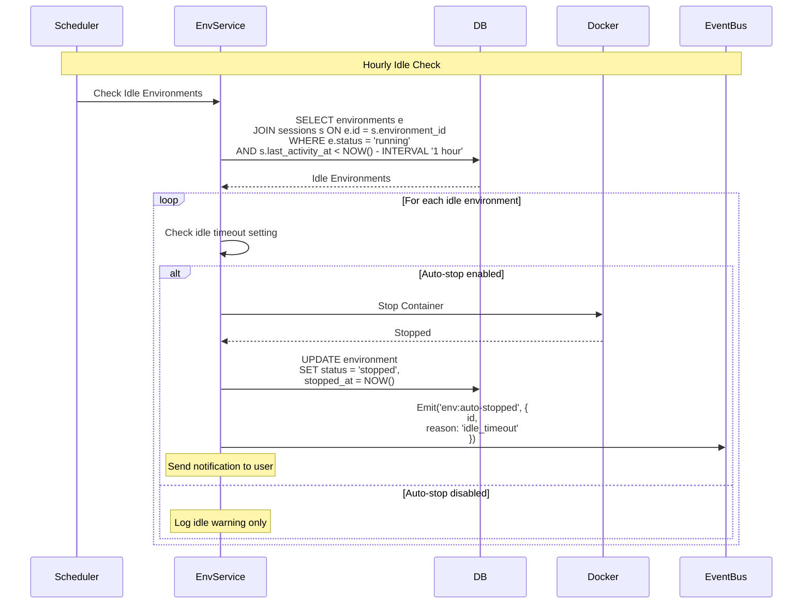
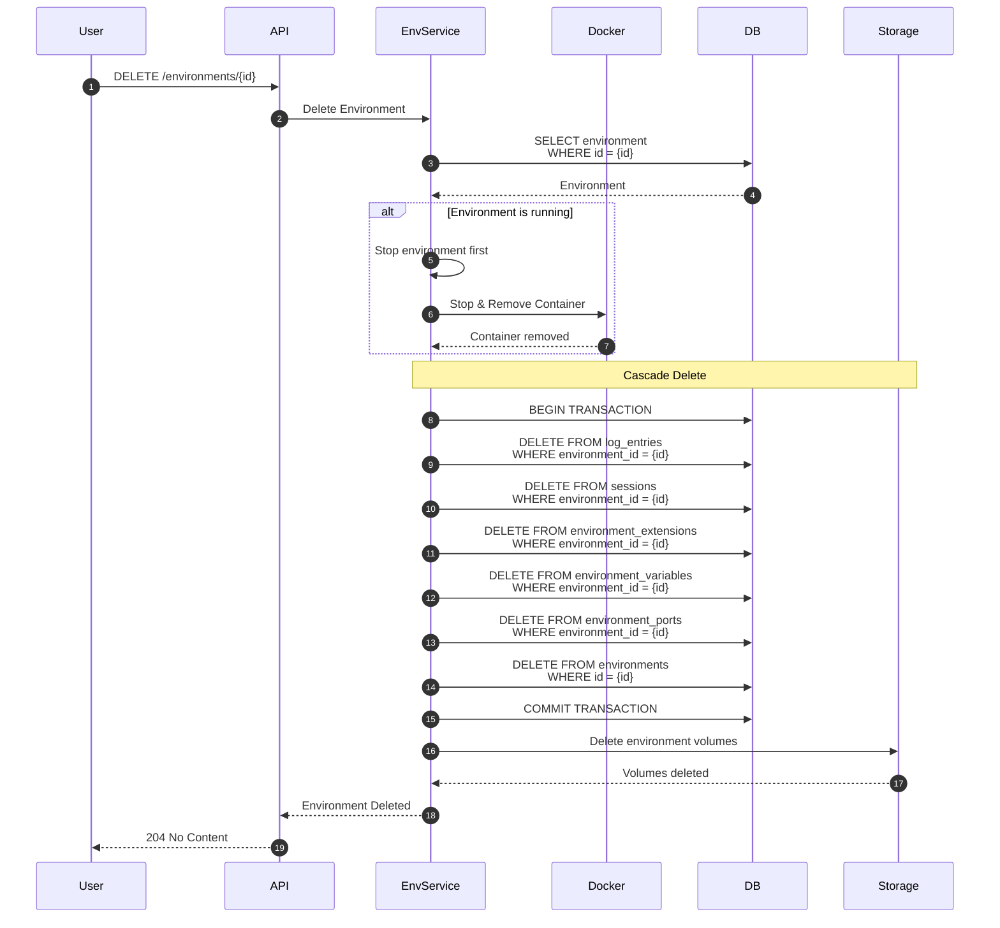
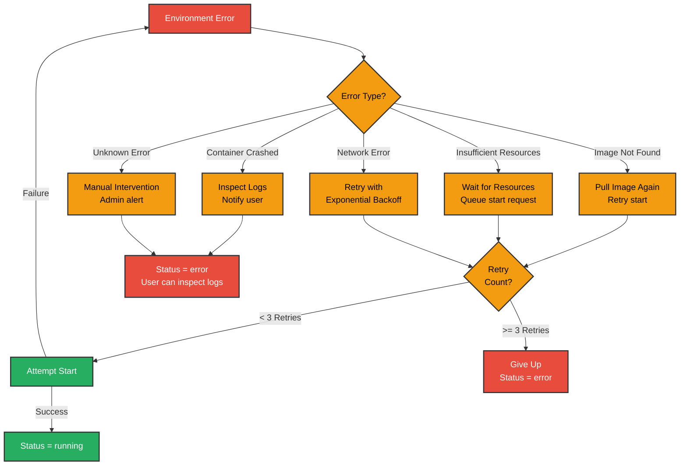

# Environment Lifecycle State Diagram

## Complete Environment State Machine



## Environment Creation Flow



## Environment Start Flow



## Environment Stop Flow



## Environment Health Monitoring



## Resource Limit Enforcement

```mermaid
graph TB
    Start[Environment Starting]

    Start --> CheckLimits{Check<br/>Limits}

    CheckLimits --> ValidateCPU[Validate CPU Limit<br/>0.5 - 8.0 cores]
    ValidateCPU --> ValidateMem[Validate Memory<br/>512MB - 16GB]
    ValidateMem --> ValidateStorage[Validate Storage<br/>1GB - 100GB]

    ValidateStorage --> CreateConfig[Create Docker Config]

    CreateConfig --> SetCPU[Set CPU Limit<br/>--cpus={cpuLimit}]
    SetCPU --> SetMem[Set Memory Limit<br/>--memory={memoryLimit}m]
    SetMem --> SetStorage[Set Storage Limit<br/>--storage-opt size={storageLimit}m]

    SetStorage --> CreateContainer[Create Container]

    CreateContainer --> Monitor{Continuous<br/>Monitoring}

    Monitor -->|CPU > Limit| Throttle[CPU Throttling<br/>Container slowed]
    Monitor -->|Memory > Limit| OOM[OOM Kill<br/>Container terminated]
    Monitor -->|Storage > Limit| WriteError[Write Error<br/>No space left]

    Throttle --> Monitor
    OOM --> ErrorState[Environment<br/>status = error]
    WriteError --> Monitor

    classDef validate fill:#3498db,stroke:#333,stroke-width:2px,color:#fff
    classDef config fill:#f39c12,stroke:#333,stroke-width:2px,color:#000
    classDef limit fill:#e74c3c,stroke:#333,stroke-width:2px,color:#fff

    class CheckLimits,ValidateCPU,ValidateMem,ValidateStorage validate
    class CreateConfig,SetCPU,SetMem,SetStorage,CreateContainer config
    class Throttle,OOM,WriteError,ErrorState limit
```

## Auto-Stop Idle Environments



## Environment Deletion Flow



## State Transition Matrix

| From State | To State | Trigger | Pre-conditions | Post-actions |
|-----------|---------|---------|----------------|--------------|
| stopped | starting | User start | Environment exists | Pull image, create container |
| starting | running | Container started | Image pulled, resources available | Update DB, emit event |
| starting | error | Start failed | Insufficient resources, image not found | Log error, notify user |
| running | stopping | User stop | Environment running | Terminate sessions |
| running | error | Container crashed | Container exited unexpectedly | Log error, notify user |
| stopping | stopped | Container stopped | Graceful shutdown complete | Update DB, clean up resources |
| stopping | error | Stop failed | Container unresponsive | Force kill container |
| error | starting | User retry | Error acknowledged | Retry with same config |
| error | stopped | User acknowledge | Error noted | Clean up partial resources |
| * | deleted | User delete | User has permission | Cascade delete all related data |

## Error Recovery Strategies



## Metrics & Observability

**State Duration Metrics**:
- Time in `starting` state (should be < 2 minutes)
- Time in `running` state (uptime)
- Time in `stopping` state (should be < 30 seconds)
- Time in `error` state (before recovery)

**State Transition Counters**:
- `stopped` → `starting` (start attempts)
- `starting` → `running` (successful starts)
- `starting` → `error` (failed starts)
- `running` → `stopping` (stop requests)
- `running` → `error` (crashes)

**Alerts**:
- Environment stuck in `starting` for > 5 minutes
- Environment stuck in `stopping` for > 2 minutes
- More than 3 consecutive start failures
- Container crash rate > 10% per hour
