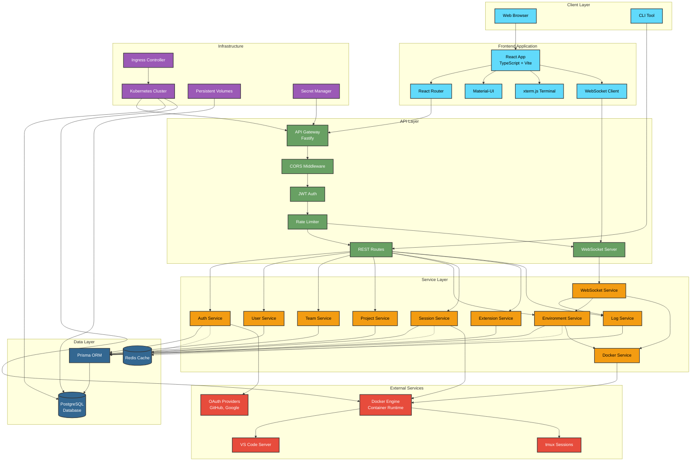
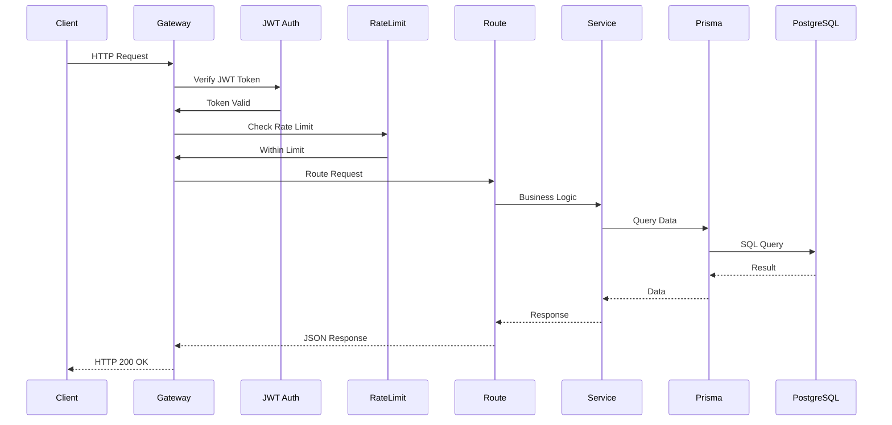
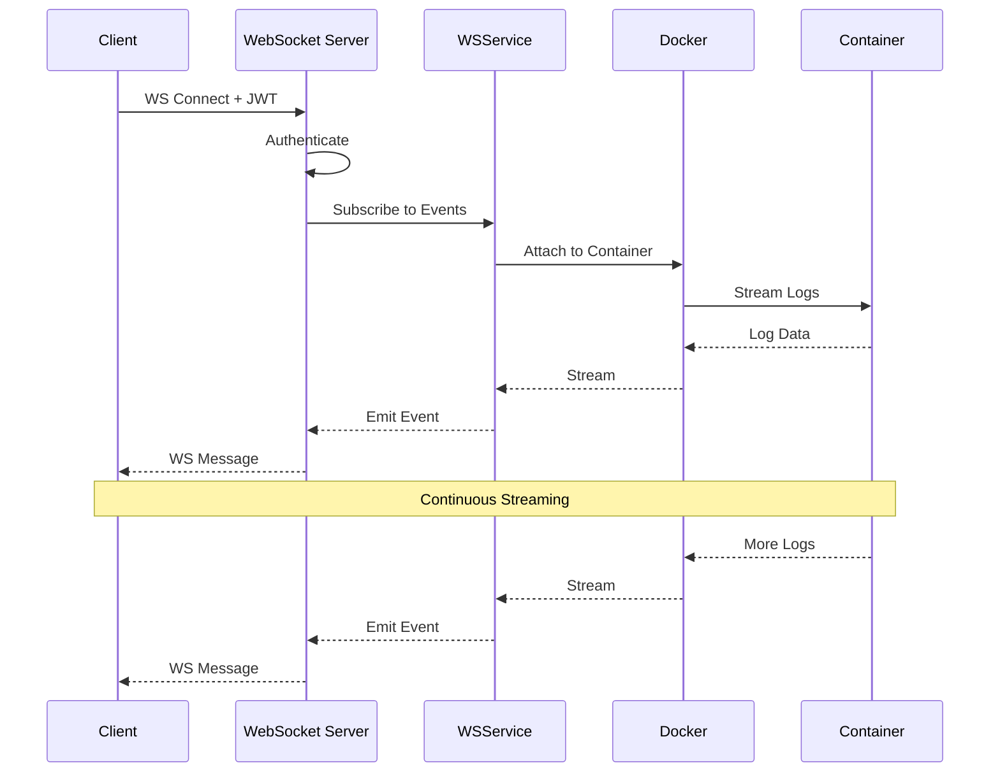
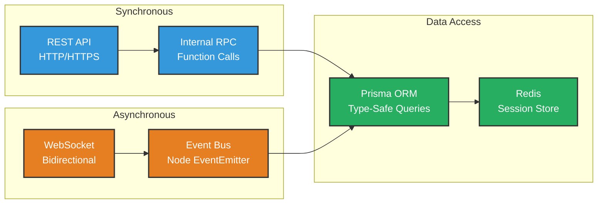
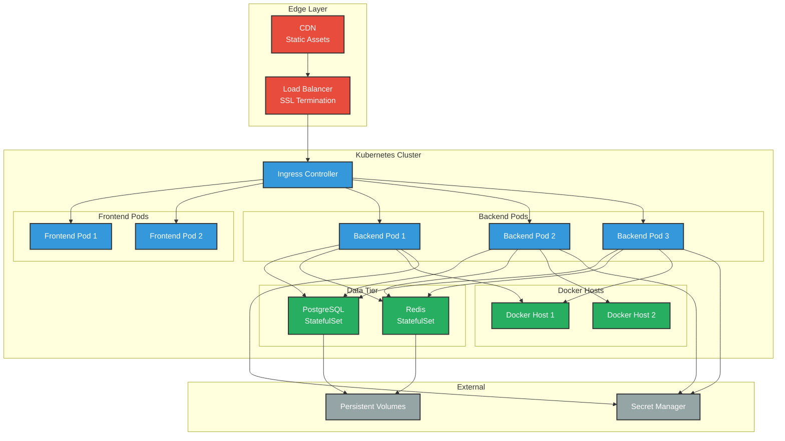
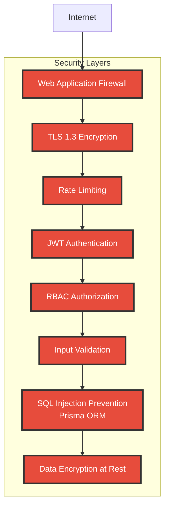
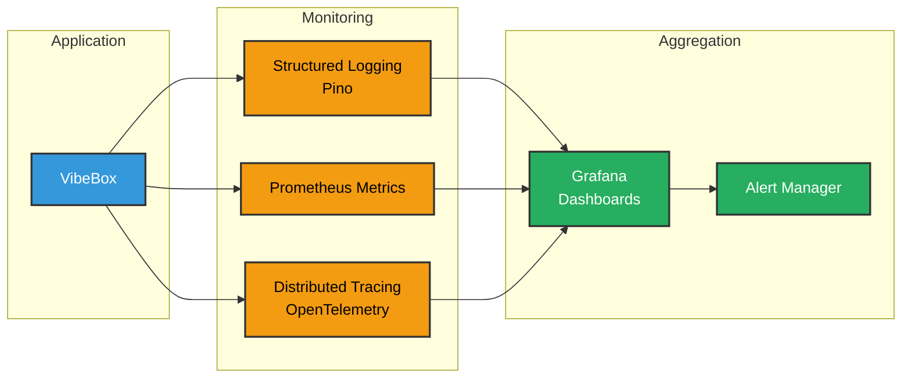

# System Architecture Overview - Mermaid Format

## High-Level System Architecture

This diagram shows the complete system architecture of VibeBox, including all major components and their interactions.

## Request/Response Flow

### REST API Request Flow

### WebSocket Connection Flow

## Component Communication

## Technology Stack

| Layer | Technologies |
|-------|-------------|
| **Frontend** | React 18, TypeScript 5.x, Material-UI, Vite, xterm.js |
| **API** | Fastify, JWT, CORS, WebSocket, Rate Limiting |
| **Services** | Node.js 20, TypeScript, dockerode, Passport.js |
| **Data** | PostgreSQL 16, Prisma ORM, Redis |
| **Infrastructure** | Docker, Kubernetes, Nginx Ingress |
| **External** | GitHub OAuth, Google OAuth, VS Code Server |

## Deployment Architecture

## Security Layers

## Performance Optimization

- **Caching**: Redis for sessions, JWT blacklist, environment state
- **Connection Pooling**: PostgreSQL connection pool (max 20 connections)
- **Horizontal Scaling**: Multiple backend pods with load balancing
- **Resource Limits**: CPU/Memory limits on Docker containers
- **Database Indexes**: Optimized queries with composite indexes
- **WebSocket**: Efficient real-time updates without polling
- **CDN**: Static asset delivery at edge locations

## Monitoring & Observability

