# WebSocket Architecture & Flow

## WebSocket Connection Lifecycle

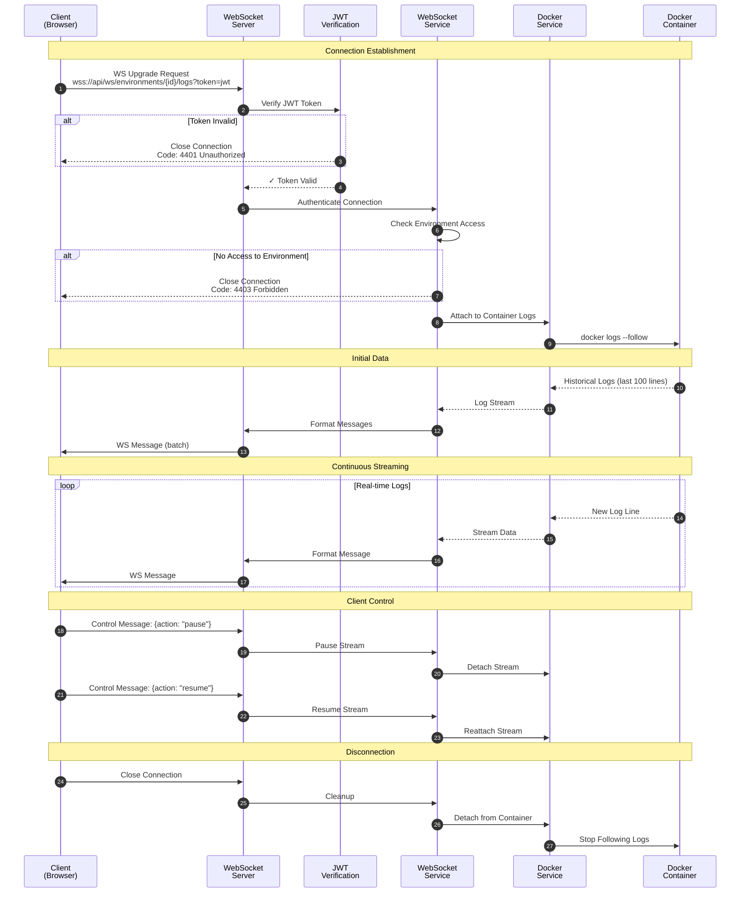

## WebSocket Endpoint Types

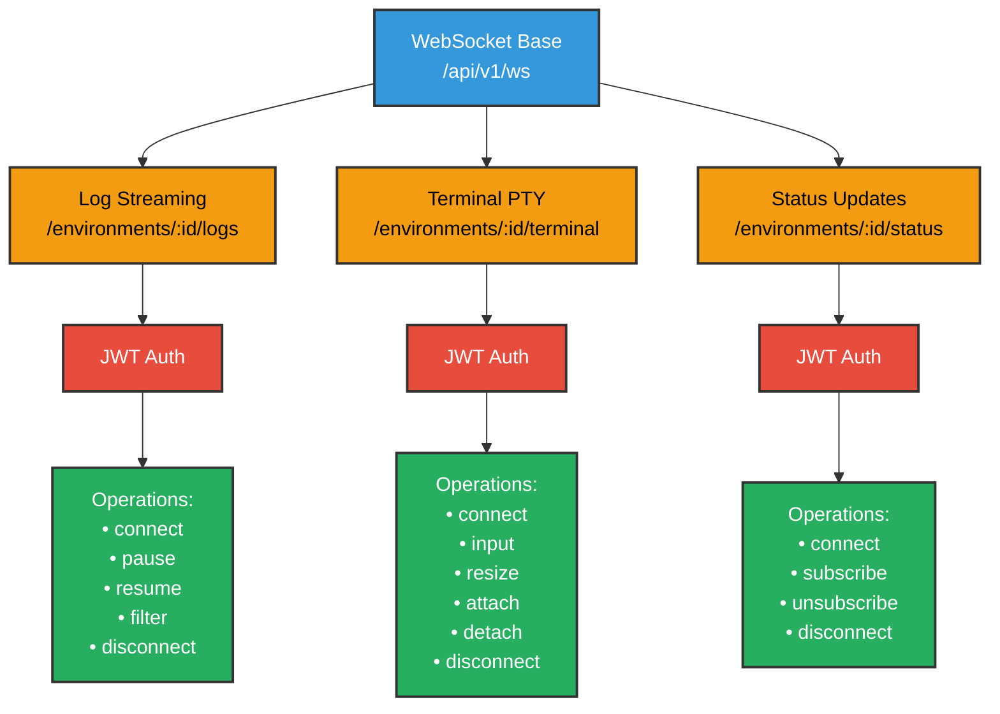

## Log Streaming Flow

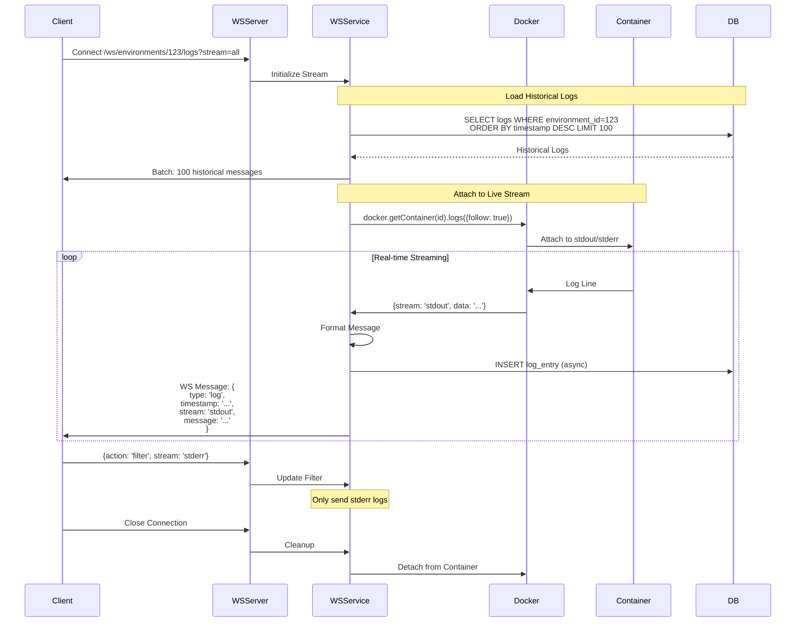

## Terminal (PTY) Flow

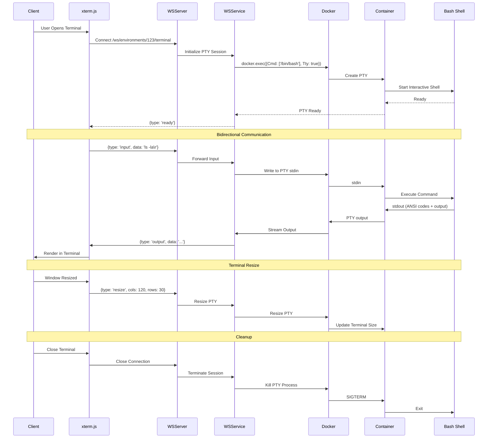

## Status Updates Flow

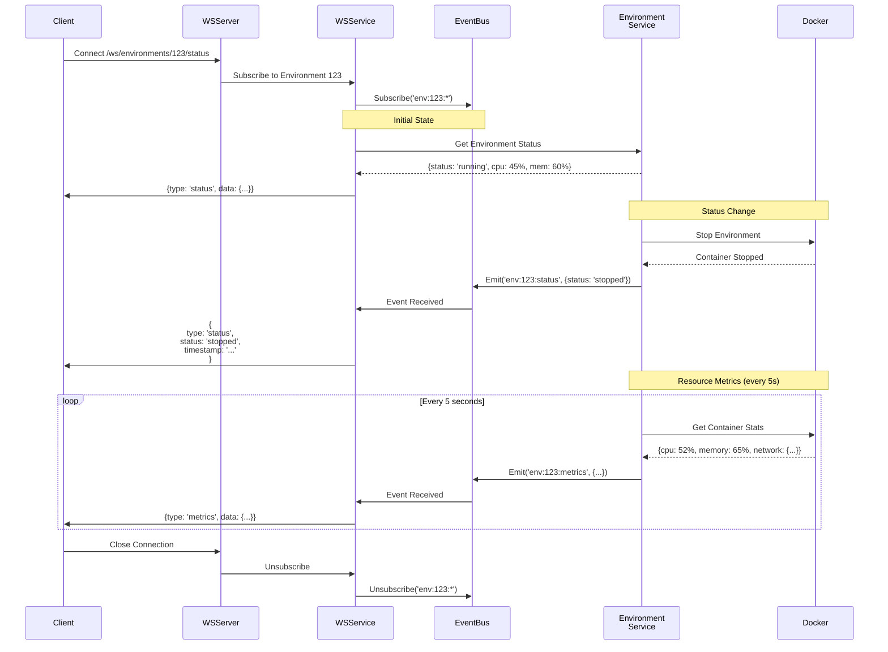

## WebSocket Message Types

### Log Streaming Messages

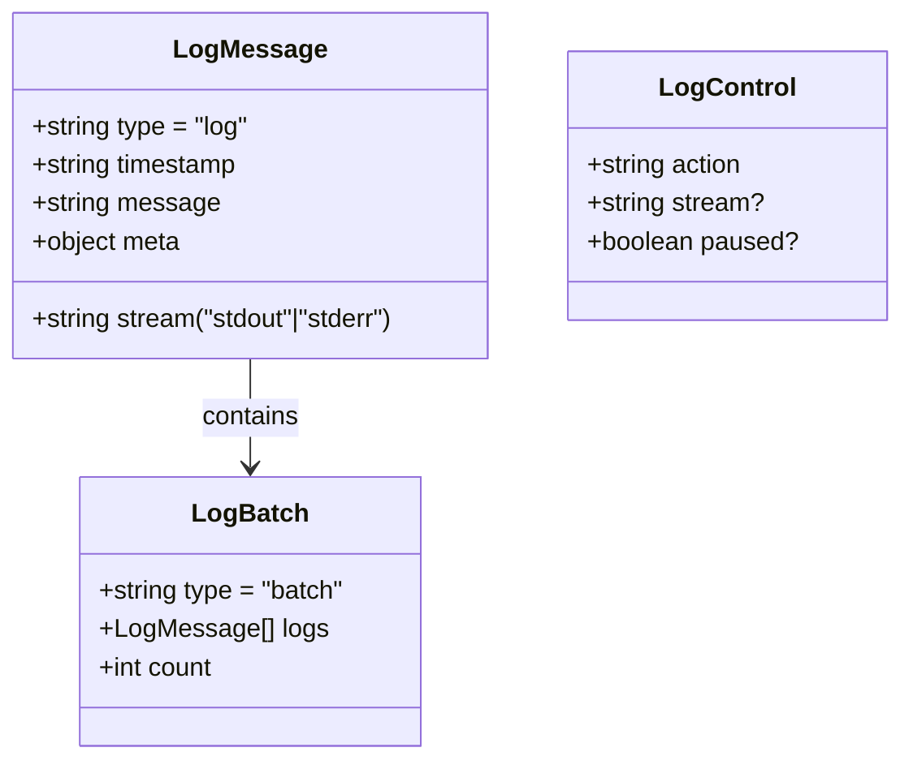

**Client → Server (Control)**:
```json
{
  "action": "pause"
}
```

```json
{
  "action": "filter",
  "stream": "stderr"
}
```

**Server → Client (Data)**:
```json
{
  "type": "log",
  "timestamp": "2025-10-01T12:00:00.123Z",
  "stream": "stdout",
  "message": "Application started on port 3000"
}
```

### Terminal Messages

**Client → Server (Input)**:
```json
{
  "type": "input",
  "data": "ls -la\r"
}
```

```json
{
  "type": "resize",
  "cols": 120,
  "rows": 30
}
```

**Server → Client (Output)**:
```json
{
  "type": "output",
  "data": "\u001b[32mfile.txt\u001b[0m"
}
```

```json
{
  "type": "ready"
}
```

### Status Update Messages

**Server → Client**:
```json
{
  "type": "status",
  "status": "running",
  "timestamp": "2025-10-01T12:00:00Z"
}
```

```json
{
  "type": "metrics",
  "cpu": 45.2,
  "memory": 2048,
  "memoryLimit": 4096,
  "network": {
    "rx": 1024000,
    "tx": 512000
  },
  "timestamp": "2025-10-01T12:00:00Z"
}
```

## Connection Management

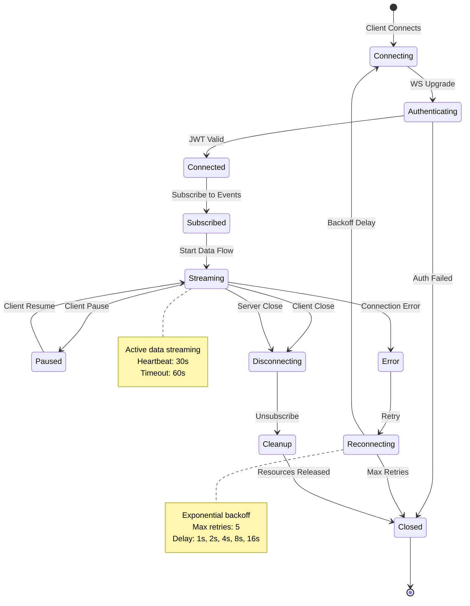

## Heartbeat & Keepalive

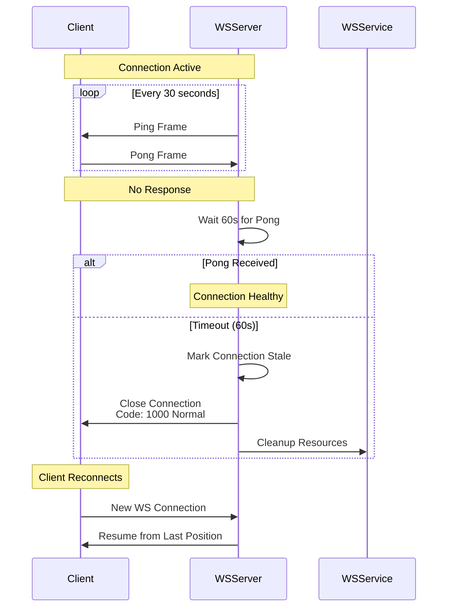

## Scalability & Load Balancing

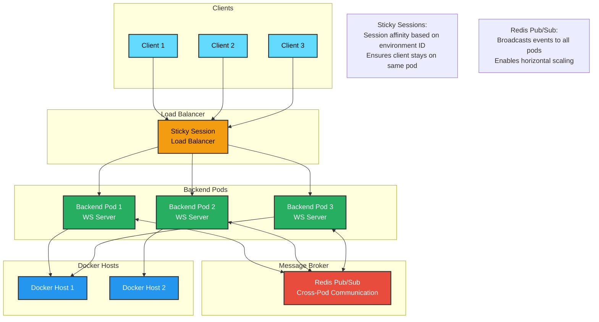

## Error Handling

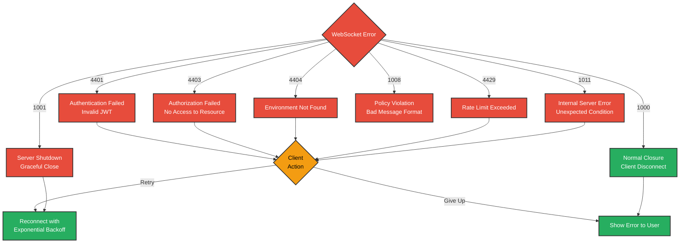

## Performance Optimization

### Batching Strategy
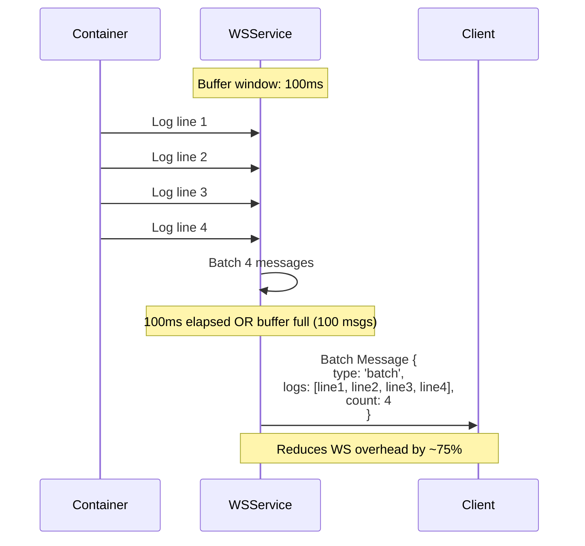

### Connection Limits
- Max connections per user: **50**
- Max connections per environment: **10**
- Max message size: **1 MB**
- Max batch size: **100 messages**
- Heartbeat interval: **30 seconds**
- Connection timeout: **60 seconds**
- Reconnect max retries: **5**

### Monitoring Metrics
- Active connections per endpoint
- Messages sent/received per second
- Average message latency
- Connection duration histogram
- Error rate by error code
- Reconnection success rate
